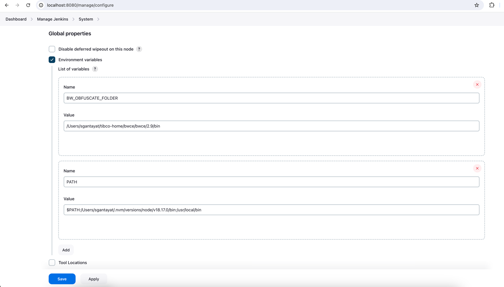
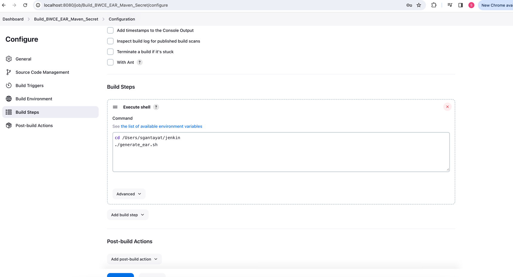

# Introduction

This document describes an example and the steps to run a template (bwce) which supports multiple secrets and uses the custom jenkins action to deploy the bwce application in the data plane.

# Steps

## Create a template

In the 'template' directory, we have placed an example bwce template, which has 2 secrets as 'db_pass' and 'app_pass' and the template also uses the custom jenkins action 'tibco:trigger-jenkins-job'.

There is a sample bwce project template exists inside the 'template' directory named as 'test-secret' which is used in 'fetch:template' step of the template'.

In this 'test-secret' folder, in the below files, in place of the secret we have added the texts as @@SECRET1@@ and @@SECRET2@@, which will be replaced by the input values 'db_pass' and 'app_pass', entered by user while running the template, in 'tibco:trigger-jenkins-job' action while deploying the application.

Files:

/test-secret/TestSecret/META-INF/default.substvar

/test-secret/TestSecret.module/META-INF/default.substvar

We have passed secrets as an object in the 'tibco:trigger-jenkins-job' action, ex: SECRET1 and SECRET2

We can crate our own template or modify the above template as per the requirement.

## Install custom jenkins action (tibco:trigger-jenkins-job)

We have exported the custom jenkins action named as 'jenkins-app-deploy-backend', as a plugin which is inside the 'plugins' folder of the root of the project.

Go through the readme file inside the plugin to add the custom action to developer hub.

## Set up jenkins

> Note: In this example we have set up jenkins in MAC locally, for other operating systems/ servers script and configuration should be done accordingly

[Install jenkins (Tested with Version 2.426.3)](https://www.jenkins.io/doc/book/installing)

[Install node js (Tested with Version 18.17.0)](https://nodejs.org/en/download)

[Install Java (Tested with Version 20)](https://nodejs.org/en/download)

[Install maven (Tested with Version 3.9.6)](https://maven.apache.org/install.html)

[Install TIBCO Business Studio for BusinessWorks (Tested with Version 2.9.1)](http://reldist.na.tibco.com/package/bwce/2.9.1/V52.3.2-GA)

In our example jenkins is running in http://localhost:8080/

Go to http://localhost:8080/manage/configure and add the below Environment variables under Global properties

Environment variables:
BW_OBFUSCATE_FOLDER : Path to the bin folder where bwce studo has been installed ex: /Users/sgantayat/tibco-home/bwce/bwce/2.9/bin
PATH: Add path of node js and maven ex: $PATH:/Users/sgantayat/.nvm/versions/node/v18.17.0/bin:/usr/local/bin



Go to http://localhost:8080/view/all/newJob and create a jenkins project using Freestyle project, ex: 'Build_BWCE_EAR_Maven_Secret'


Go to http://localhost:8080/job/Build_BWCE_EAR_Maven_Secret/configure and check 'This project is parameterised' under 'General' section

Add the blow parameters
repo_host (String Parameter)
repo_owner (String Parameter)
repo_name (String Parameter)
bw_project_folder (String Parameter)
SECRET1 (Password Parameter)
SECRET2 (Password Parameter)

> Note: We have added SECRET1 and SECRET2 as parameter because we have passed these 2 secrets as input via secret object while creating the template, check [Here](#create-a-template)


Check 'Trigger builds remotely' under 'Build Triggers' section and provide Authentication Token, ex: BuildEARToken


Go to the Settings page of the Tibco control plane, ex: https://tibcohub.us-west.cp-platform-my.tcie.pro/cp/app/settings/oauth-token and generate the OAuth token


Check 'Use secret text(s) or file(s)' under 'Build Environment' section and add secret text. Provide variable name as 'platform_token'. Add Credentials to Jenkins Credentials provider, Select kind as 'Secret text', provide secret value as the OAuth token generated in the previous step and ID as 'platformToken'. Select Credentials-> Specific credentials as 'platformToken'.


Add another secret text. Provide variable name as 'secret_encryption_key'. Add Credentials to Jenkins Credentials provider, Select kind as 'Secret text', provide secret value as the encryption key to be used to encrypt/decrypt the secret and which was provided in the app.config and ID as 'secretEncryptionKey'. Select Credentials-> Specific credentials as 'secretEncryptionKey'.


Create a folder in the file system of the computer, ex: /Users/sgantayat/jenkin and copy the decrypt.js file, replaceInDir.js and ganerate-ear.sh file form the current folder (same folder where this readme file is) to the newly created folder.

Add a Build Step as 'Execute shell' under 'Build Steps' section and provide the below command to run the shell script copied in the previous step.

Change the DP_URL, NAMESPACE, BASE_VERSION, BASE_IMAGE_TAG accordingly as per the bwce requirement.

```
cd /Users/sgantayat/jenkin
export DP_URL="https://developer.infra.platform-int.dataplanes.pro/tibco/bw/"
export NAMESPACE="tibco-hub-sagar"
export BASE_VERSION="2.9.1"
export BASE_IMAGE_TAG="101-2.9.1-V52.3.2-GA-debian"
./generate_ear.sh
```

> Note: The scripts needs to be changes accordingly for the secret values and number of secret values passed

> Note: The scripts clones the repository provided in repo_name parameter using SSH, so GIT should be configured correctly in the system



## Run the template and deploy bwce application

Go to Manage Jenkins-> Security-> Users (http://localhost:8080/manage/securityRealm/), select the user and create API token under 'Configure' section.


Now to run Tibco hub locally add the below configuration to the app-config.local.yaml.

```
jenkins:
  baseUrl: http://127.0.0.1:8080
  username: subrat
  apiKey: xxxxxxxxx
  jenkinsActionSecretEncryptionKey: xxxxxxxxxxxxxxxxx
  jenkinsActionJobAuthToken: BuildEARToken
```

Here provide the apiKey as the Jenkins API token we have generated in the previous step.

jenkinsActionSecretEncryptionKey is the encryption key to be used to encrypt/decrypt the secret, which we have also added while configuring Jenkins.

jenkinsActionJobAuthToken is the Authentication Token provided while configuring Jenkins in 'Trigger builds remotely' under 'Build Triggers'.

Fill other values as required.

Add the template to software catalog by adding the below configuration to the app-config.local.yaml.

```
catalog:
  locations:
    # Local example data, file locations are relative to the backend process, typically `packages/backend`
    - type: file
      target: ../../examples/jenkins-app-deploy-backend/template/template-test-secret.yaml
  rules:
    - allow:
        - Component
        - API
        - Location
        - Template
        - User
        - Group
        - Domain
        - System
        - Resource
```

> Note: GitHub PAT should be set previously in app.config

Now run the Tibco hub application using 'yarn dev' and run the template filling the required inputs added in the previous step.


Now we can see the bwce app has been deployed to the data plane.

## Install the Jenkins Plugin

Go through the documentation mentioned in https://www.npmjs.com/package/@backstage/plugin-jenkins to install the Jenkins plugin.

Now we can see the CI/CD tab in the catalog detail page where we can find the Jenkins projects and details.


