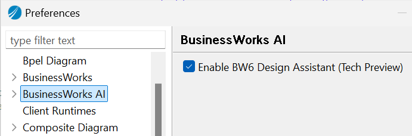
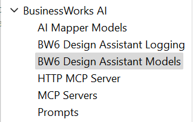
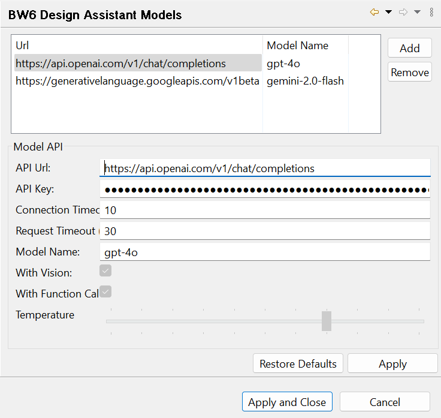
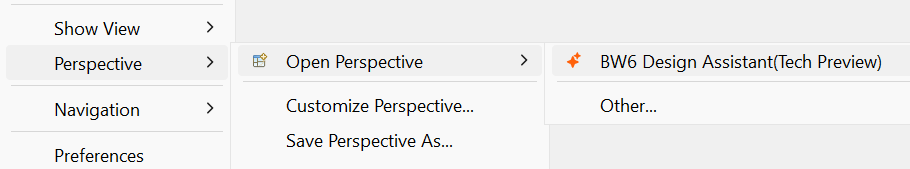

# BusinessWorks Design Assistant — Setup Guide

This guide walks you through the steps required to enable and configure the **BW6 Design Assistant** in TIBCO ActiveMatrix BusinessWorks™ Studio.

---

## Prerequisites

Before getting started, ensure the following are in place:

| Requirement | Details |
| :---- | :---- |
| **BusinessWorks Version** | BusinessWorks 6.12.0 HF2 or later |
| **API Key** | A valid API key for either **OpenAI** or **Google Gemini** |

> **Note:** The Design Assistant will not function without a valid API key from a supported model provider.

You can download Business works 6.12 from here: https://www.tibco.com/downloads/10001/secure/download-10001

You can download the Hotfix from here: https://support.tibco.com/wolken-support/file_structure

---

## Setup Steps

### Step 1: Enable the BW6 Design Assistant

* Navigate to **Windows → Preferences → BusinessWorks AI**
* Check the option **"Enable BW6 Design Assistant"**
* Click **Apply and Close**

---

### Step 2: Relaunch the Preferences Window

* Close the Preferences window
* Reopen it via **Windows → Preferences**
* Expand the **BusinessWorks AI** section in the left panel — additional configuration options will now be visible

---

### Step 3: Configure the AI Model and API Key

* Navigate to **BusinessWorks AI → BW6 Design Assistant Models**
* Select a model of your choice from the available options (OpenAI or Gemini)
* Enter your **API Key** in the corresponding field

---

### Step 4: Apply and Close

* Click **Apply** to save the configuration
* Click **Close** to exit the Preferences window

---

### Step 5: Open the BW6 Design Assistant Perspective

* Navigate to **Windows → Perspective → Open Perspective**
* Select **BW6 Design Assistant** from the list of available perspectives
* The Design Assistant panel will open in your BW Studio workspace

---

## You Are All Set!

You are now ready to start automating your application development with the **BW6 Design Assistant**. Use the prompts from the **BusinessWorks Integration Prompt Library** to get started quickly with common integration scenarios.

---

## Quick Reference

| Step | Action | Location |
| :---- | :---- | :---- |
| 1 | Enable Design Assistant | Windows → Preferences → BusinessWorks AI |
| 2 | Relaunch Preferences | Windows → Preferences → BusinessWorks AI (expanded) |
| 3 | Select model and enter API Key | BusinessWorks AI → BW6 Design Assistant Models |
| 4 | Save configuration | Apply and Close |
| 5 | Open perspective | Windows → Perspective → Open Perspective → BW6 Design Assistant |
