# Impact Analysis — Changing `car-information-api`

> **Subject:** `api:default/car-information-api`
> **System:** `car-order-system` · **Domain:** `cars`
> **Generated:** 2026-06-01 · **Source:** TIBCO Developer Hub catalog (via the catalog REST API, `GET /api/catalog/entities/by-name/…`)
> **Scope:** What breaks / needs review / is safe if the `car-information-api` contract changes.

---

## 1. Executive summary

`car-information-api` is an **OpenAPI (Swagger 2.0) production API** owned by **operational-department**. Within the `car-order-system` it sits between exactly one provider and one consumer:

- **Provider (implements the contract):** `car-information-provider`
- **Consumer (calls the contract):** `car-order-ui`

A change to this API therefore has a **small, well-contained blast radius**: the two directly-coupled components and their shared owner. Crucially, **all three high-impact entities belong to a single team (operational-department)**, so a backward-compatible change can be coordinated within one team.

The only way the radius widens is *second-order*: if the new contract needs **new data**, the provider may have to ask `db-adapter` to extend the upstream `car-details-api` — and that API is **also consumed by `discount-calculator` (finance-department)**, creating a potential cross-team ripple.

| Tier | Count | Entities |
|------|-------|----------|
| 🔴 Direct / High | 3 | `car-information-api`, `car-information-provider`, `car-order-ui` |
| 🟠 Conditional / Transitive | 3 | `car-details-api`, `db-adapter`, `cars-promotional-materials` |
| 🟢 Not impacted | 4 | `car-analyzer`, `discount-calculator`, `car-discount-api`, `cars-database` |

---

## 2. Color legend

These colors are used consistently in every diagram and table below.

| Color | Tier | Meaning |
|-------|------|---------|
| 🔴 **Red** | Change / Direct | The API itself + entities directly bound to its contract. **Must change & test.** |
| 🟠 **Amber (dashed)** | Conditional | Only impacted *if* the change requires new upstream data. **Review.** |
| 🟢 **Green** | Safe | No dependency path to the API. **No action.** |
| 🔵 **Blue** | Owner / Stakeholder | Teams to notify & coordinate. |

---

## 3. Integration topology — impact blast radius

Full `car-order-system` topology, color-coded by impact tier. Edges show the direction of the dependency (`provides` / `consumes` / `dependsOn`).

**How to read it:** the 🔴 red cluster is the contract and the two components bound to it. The 🟠 amber chain is the provider's own upstream dependencies — reachable only if the change forces new data. Everything 🟢 green is on a separate flow (`car-discount-api`) or behind unrelated resources.

---

## 4. Change-propagation (layered blast radius)

---

## 5. Ownership & coordination view

**Key coordination insight:** all 🔴 high-impact work lives inside **operational-department**. **finance-department** only needs to be in the loop *if* the conditional path is triggered (extending `car-details-api`), because its `discount-calculator` is a co-consumer of that upstream API.

---

## 6. Detailed impact by entity

### 🔴 `car-information-api` — the change itself
- **Kind/type:** API · `openapi` (Swagger 2.0). **Lifecycle:** `production`. **Owner:** `operational-department`.
- **Contract surface:** ~20 operations across `pet` / `store` / `user` tags (the catalog currently carries the Swagger Petstore sample as the definition).
- A `production` lifecycle means external/stable consumers are assumed — **treat breaking changes as high-risk**.

### 🔴 `car-information-provider` — provider (`apiProvidedBy`)
- Implements the contract. **Any** schema/endpoint change must be implemented here first.
- Also `consumes car-details-api` and `dependsOn cars-promotional-materials` — its data sources. If the new contract exposes fields the provider doesn't yet have, the work flows upstream (see Tier 2).
- **Action:** implement contract change; update provider tests; redeploy before/with the consumer.

### 🔴 `car-order-ui` — consumer (`apiConsumedBy`)
- Calls the API. **Breaking changes break the UI** (request/response shape, removed/renamed operations, auth changes).
- **Action:** update client code/models; regression-test the order flow; deploy in lockstep with the provider (or behind a version negotiation).

### 🟠 `car-details-api` / `db-adapter` / `cars-promotional-materials` — conditional
- Reachable only **if the new `car-information-api` requires data the provider must newly source.**
- If so: `car-details-api` (provided by `db-adapter`, backed by `cars-database`) and/or the `cars-promotional-materials` resource must be extended.
- ⚠️ **Cross-team ripple:** `car-details-api` is **also consumed by `discount-calculator` (finance-department)** — extending it pulls finance into the change. Prefer **additive** changes to `car-details-api` to keep `discount-calculator` unaffected.

### 🟢 Not impacted
| Entity | Why safe |
|--------|----------|
| `car-analyzer` | No relation to `car-information-api`; depends only on `cars-database` + `cars-promotional-materials`. |
| `discount-calculator` | On the `car-discount-api` flow; only *conditionally* involved via `car-details-api`. |
| `car-discount-api` | Separate API the UI consumes independently. |
| `cars-database` | Reached only via `db-adapter`/`car-analyzer`, outside the API contract path. |

---

## 7. Risk assessment

| Change type | Risk | Blast radius |
|-------------|------|--------------|
| **Additive, backward-compatible** (new optional field/endpoint) | 🟢 Low | Provider implements; UI adopts when ready. Contained in operational-department. |
| **Breaking** (rename/remove/retype, auth change) | 🔴 High | Provider **and** UI must change & deploy together; production lifecycle = coordinate a version bump. |
| **Requires new backend data** | 🟠 Medium | Adds the `car-details-api` → `db-adapter` chain; risks dragging in `discount-calculator` (finance). |

---

## 8. Recommendations & checklist

1. **Prefer additive/backward-compatible changes.** Keeps the change inside operational-department with no lockstep deploy.
2. **If breaking, version the API** (e.g. `/v2`) so `car-order-ui` can migrate without downtime; keep the old version until the UI cuts over.
3. **Contract testing** between `car-information-provider` (provider) and `car-order-ui` (consumer) before merge.
4. **Keep upstream changes additive.** If `car-details-api` must grow, add fields rather than changing existing ones, so `discount-calculator` stays untouched.
5. **Update the catalog.** Refresh the OpenAPI `definition` in `flogo-car-information-provider.yaml` so the Developer Hub reflects the new contract.

**Pre-merge checklist**
- [ ] Provider `car-information-provider` updated + unit tests
- [ ] Consumer `car-order-ui` updated + order-flow regression test
- [ ] Provider/consumer contract test green
- [ ] Versioning decided (breaking changes only)
- [ ] `car-details-api` extension assessed (additive?) — **loop in finance-department if touched**
- [ ] OpenAPI `definition` updated in the catalog YAML
- [ ] Provider deployed before/with consumer

**Notify:** `operational-department` (owner of API + provider + consumer + db-adapter). `finance-department` **only** if `car-details-api` is modified.

---

## 9. Provenance

All relationships were read live from the running Developer Hub catalog via the catalog REST API (`GET /api/catalog/entities/by-name/…`, with `POST /api/catalog/entities/by-refs` for neighbour traversal). The raw relation data is captured in [`catalog-data-snapshot.md`](./catalog-data-snapshot.md).
