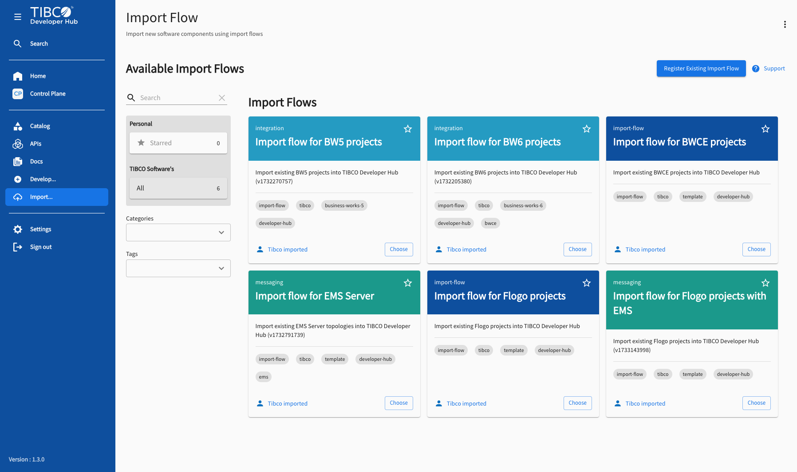
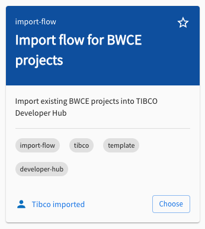
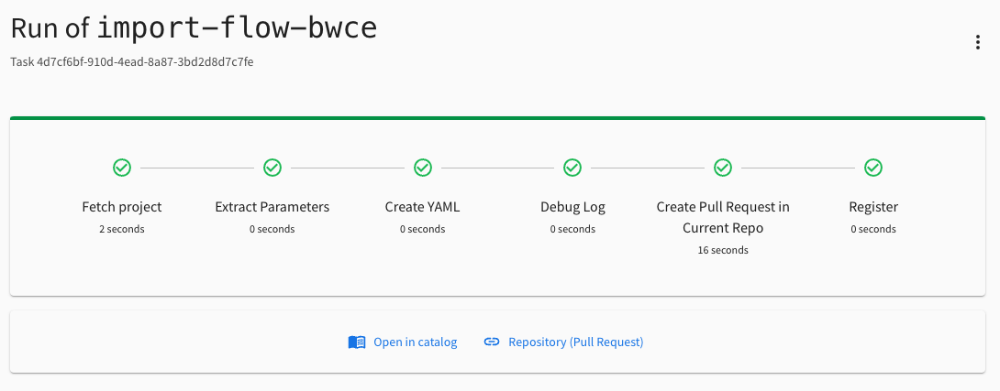
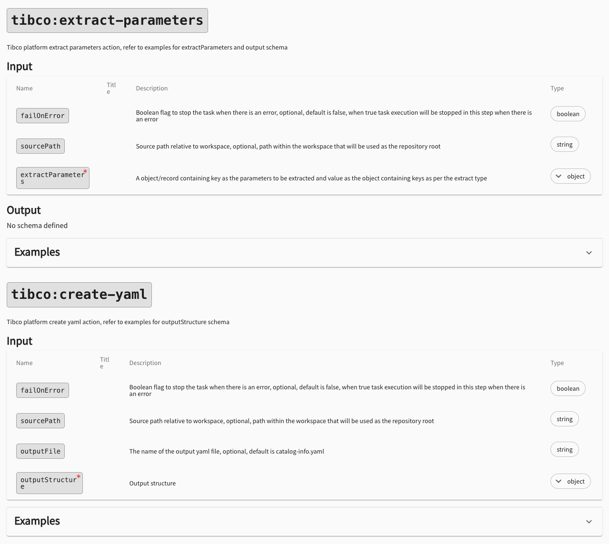
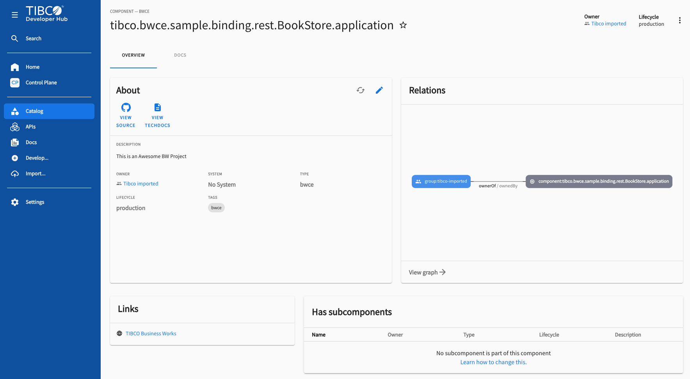
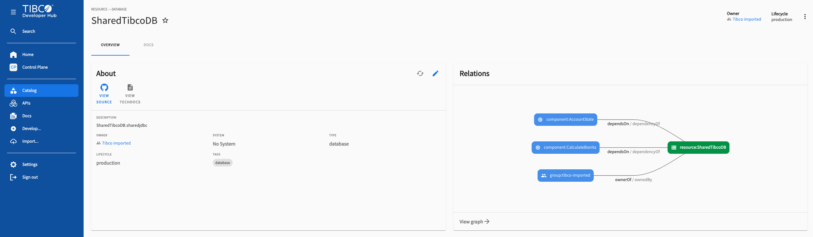

# Create an Import Flow

Where a template scaffolds a brand-new project, an **import flow** does the opposite: it takes
source code you already have and pulls it into the TIBCO Developer Hub as catalog entities. This
guide explains what an import flow is, how it is built on top of the template machinery, the
extra (custom) actions that make it work, and how to register and run one.

## What is an import flow?

An import flow takes existing source code, generates catalog entities from it, and registers
those entities in the Developer Hub. It is the fastest way to **fill the Developer Hub with
content you already own** instead of building everything from scratch. You decide the level of
**granularity** — whether a repository becomes a single Component, or a richer graph of Systems,
Components, APIs, and Resources.

Import flows appear under **Import** in the left navigation (not under Develop). You can search,
sort, filter, and star them just like templates.



## An import flow is a template with extra actions

Technically, an import flow is the same entity as a template: a Backstage
`scaffolder.backstage.io/v1beta3` `Template`. Two things make it an import flow:

- the **`import-flow` tag**, which routes it to the Import page instead of Develop, and
- a set of **custom actions** in its steps that clone a repo, read metadata out of the source,
  generate catalog YAML, and push it back.

```yaml
apiVersion: scaffolder.backstage.io/v1beta3
kind: Template
metadata:
  name: import-flow-bwce
  title: Import flow for BWCE projects
  description: Import existing BWCE projects into TIBCO Developer Hub
  tags:
    - import-flow      # <- this tag makes it an import flow
    - tibco
    - template
    - developer-hub
spec:
  owner: group:default/tibco-imported
  type: import-flow
```

Because it is a template, everything from the **[Template Tutorial](/docs/default/System/create-template)**
applies here too: the form is defined in `parameters` (rendered with react-jsonschema-form), the
work happens in `steps`, and you can edit and preview it in the Template Editor. The ellipsis
menu in the top-right of an import flow gives you the same **Template Editor**, **Installed
Actions**, and **Task List** options. This guide focuses on what is *different*: the steps and
the custom actions.



## The import-flow steps

A typical import flow runs five steps in order:

1. **Fetch / Clone** the existing repository into the workspace.
2. **Extract** metadata (name, description, …) from the source files.
3. **Create YAML** — generate the catalog entity descriptor from the extracted values.
4. **Create a Pull Request / Push** the generated YAML back to the repository.
5. **Register** the entity in the Software Catalog.



## The custom actions

These are the "extra" actions that a regular template does not use. You can see all of them,
with their full input and output schemas, on the
**[Installed Actions](/tibco/hub/create/actions)** page.



### `tibco:git:clone` (or `fetch:plain`)
Clones the existing Git repository into the workspace so later steps can read its files. Set
`failOnError: true` so the run stops if the clone fails.

### `tibco:extract-parameters`
Reads values out of the cloned source. This is the heart of an import flow. There are **four
extraction types**:

| Type | Query language | Use for |
|------|----------------|---------|
| `xml` | xPath *or* JSONPath | TIBCO BW `.project` / `.application` descriptors |
| `json` | JSONPath | Flogo `.flogo` apps, any JSON file |
| `file` | RegEx (string or `regexPattern`/`regexFlags`) | match text inside a single file |
| `workspace` | RegEx over a `directoryPath` (+ optional `glob`) | discover files/folders by name |

```yaml
    - id: extract
      name: Extract Parameters
      action: tibco:extract-parameters
      input:
        failOnError: true
        extractParameters:
          bwce_project_name:
            type: xml
            filePath: ${{ parameters.application + "/" + parameters.application + ".application/.project" }}
            xPath: string(/projectDescription/name)
          bwce_project_description:
            type: xml
            filePath: ${{ parameters.application + "/" + parameters.application + ".application/.project" }}
            xPath: string(/projectDescription/comment)
```

**Important:** the output of every extracted parameter is always an **array**, so reference the
first element — `${{ steps.extract.output.bwce_project_name[0] }}`.

### `tibco:create-yaml`
Builds the catalog descriptor (a `Component`, or any other entity such as `System`, `API`,
`Resource`, `Domain`) from the extracted values and writes it to a file.

```yaml
    - id: createYaml
      name: Create YAML
      action: tibco:create-yaml
      input:
        outputFile: ${{ parameters.application + "/" + parameters.application + "-bwce-catalog-info.yaml" }}
        outputStructure:
          apiVersion: backstage.io/v1alpha1
          kind: Component
          metadata:
            name: ${{ steps.extract.output.bwce_project_name[0] }}
            description: ${{ steps.extract.output.bwce_project_description[0] }}
            tags:
              - bwce
            annotations:
              github.com/project-slug: ${{ "https://" + (parameters.repoUrl | parseRepoUrl).host + "/" + (parameters.repoUrl | parseRepoUrl).owner + "/" + (parameters.repoUrl | parseRepoUrl).repo }}
              backstage.io/techdocs-ref: dir:.
          spec:
            type: bwce
            lifecycle: production
            owner: ${{ parameters.owner }}
```

### `publish:github:pull-request` (or `tibco:git:push`)
Commits the generated YAML back to the source repository — typically as a pull request, so the
descriptor lives alongside the code it describes.

### `catalog:register`
Registers the new entity in the Software Catalog so it shows up under Catalog.

### Filters
Two helper filters are available inside expressions: `decodeBase64` and `encodeBase64`, e.g.
`${{ parameters.value | decodeBase64 }}`.

## A complete example

The full BWCE import flow ties the parameters and the five steps together:

```yaml
apiVersion: scaffolder.backstage.io/v1beta3
kind: Template
metadata:
  name: import-flow-bwce
  title: Import flow for BWCE projects
  description: Import existing BWCE projects into TIBCO Developer Hub
  tags:
    - import-flow
    - tibco
    - template
    - developer-hub
spec:
  owner: group:default/tibco-imported
  type: import-flow

  parameters:
    - title: Repository Location
      required:
        - repoUrl
      properties:
        repoUrl:
          title: GitHub repository with Existing BWCE Project
          type: string
          ui:field: RepoUrlPicker
          ui:options:
            allowedHosts:
              - github.com
    - title: Fill in some steps
      required:
        - application
        - owner
      properties:
        application:
          title: BWCE Application
          type: string
          description: Name of the BWCE Application to import
        owner:
          title: Owner
          type: string
          description: Owner of the component
          ui:field: OwnerPicker
          ui:options:
            allowedKinds:
              - Group

  steps:
    - id: fetch
      name: Fetch project
      action: fetch:plain
      input:
        url: ${{ "https://" + (parameters.repoUrl | parseRepoUrl).host + "/" + (parameters.repoUrl | parseRepoUrl).owner + "/" + (parameters.repoUrl | parseRepoUrl).repo }}

    - id: extract
      name: Extract Parameters
      action: tibco:extract-parameters
      input:
        failOnError: true
        extractParameters:
          bwce_project_name:
            type: xml
            filePath: ${{ parameters.application + "/" + parameters.application + ".application/.project" }}
            xPath: string(/projectDescription/name)
          bwce_project_description:
            type: xml
            filePath: ${{ parameters.application + "/" + parameters.application + ".application/.project" }}
            xPath: string(/projectDescription/comment)

    - id: createYaml
      name: Create YAML
      action: tibco:create-yaml
      input:
        outputFile: ${{ parameters.application + "/" + parameters.application + "-bwce-catalog-info.yaml" }}
        outputStructure:
          apiVersion: backstage.io/v1alpha1
          kind: Component
          metadata:
            name: ${{ steps.extract.output.bwce_project_name[0] }}
            description: ${{ steps.extract.output.bwce_project_description[0] }}
            tags:
              - bwce
            annotations:
              github.com/project-slug: ${{ "https://" + (parameters.repoUrl | parseRepoUrl).host + "/" + (parameters.repoUrl | parseRepoUrl).owner + "/" + (parameters.repoUrl | parseRepoUrl).repo }}
              backstage.io/techdocs-ref: dir:.
          spec:
            type: bwce
            lifecycle: production
            owner: ${{ parameters.owner }}

    - id: cpr
      name: Create Pull Request in Current Repo
      action: publish:github:pull-request
      input:
        repoUrl: ${{ parameters.repoUrl }}
        update: true
        branchName: ${{ parameters.application.replace("/", ".") }}
        title: ${{ parameters.application }}
        description: This PR adds a Component YAML to this repository.

    - id: register
      name: Register
      action: catalog:register
      input:
        catalogInfoUrl: ${{ "https://" + (parameters.repoUrl | parseRepoUrl).host + "/" + (parameters.repoUrl | parseRepoUrl).owner + "/" + (parameters.repoUrl | parseRepoUrl).repo + "/blob/" + parameters.application.replace("/", ".") + "/" + parameters.application + "/" + parameters.application + "-bwce-catalog-info.yaml" }}

  output:
    links:
      - title: Open in catalog
        icon: catalog
        entityRef: ${{ steps.register.output.entityRef }}
      - title: Repository (Pull Request)
        url: ${{ steps.cpr.output.remoteUrl }}
```

A **Flogo** import flow is almost identical — only the extraction differs: it reads the
`<app>.flogo` JSON with `type: json` and `jsonPath: $.name` (and `$.description`), and tags the
Component `flogo`.

## Handy tools for building extraction queries

Getting the xPath / JSONPath / RegEx right is the fiddly part. These evaluators let you test a
query against your source before putting it in the import flow:

- JSONPath — <https://jsonpath.com/>
- xPath — <http://xpather.com/>
- RegEx — <https://regex101.com/>
- Nunjucks templating reference (for advanced skeletons) — <https://mozilla.github.io/nunjucks/templating.html>

You can also let an **AI agent** write these queries for you: paste a snippet of your source
file (the `.flogo` JSON, the BW `.project` XML, …) and ask it for the xPath, JSONPath, or RegEx
that selects the value you want. It is often faster than crafting the expression by hand — just
verify the result with the evaluators above before committing it to your import flow.

## Registering and running an import flow

1. **Register it.** An import flow is registered like any other component: go to **Import** (or
   Develop), click **Register Existing Component**, and point it at your YAML. The file must be
   `kind: Template` and carry the `import-flow` tag.
2. **Run it.** Open **[Import](/tibco/hub/import-flow)**, click **Choose** on the flow, fill in
   the host / owner / repository and the application name, click **Review**, then **Create**.
3. **Watch it run.** The steps execute in order (Extract Parameters, Create YAML, …); use **Show
   Logs** to follow along, or **Cancel** / **Start Over** as needed. Every run is also recorded
   in the **[Task List](/tibco/hub/create/tasks)**.
4. **See the result.** When the run finishes, a pull request has been opened on the repository
   and the entity is registered. Click **Open in catalog** to view it, or **Repository (Pull
   Request)** to review the change.



## Advanced: linking components (dependencies)

The simple flow above produces a single, isolated Component. The real value of the Developer Hub
is the **integration topology** — seeing how your applications depend on each other and on shared
resources. To import those **links between components**, you use a slightly different approach.



There are three differences from the simple flow.

### 1. Extract arrays instead of single values

A relationship is rarely a single value — an application may send to several queues or depend on
several projects. So the extraction queries select **lists**, using JSONPath (or xPath) filter
expressions. For example, the EMS queues a Flogo app receives from:

```yaml
    - id: extract
      name: Extract Parameters
      action: tibco:extract-parameters
      input:
        failOnError: true
        extractParameters:
          flogo_ems_queue_receivers:
            type: json
            filePath: ${{ parameters.application_folder + "/" + parameters.application }}
            jsonPath: "$.triggers[?(@.ref == '#receivemessage')].handlers[?(@.settings.destinationType == 'Queue')].settings.destination"
```

Because the result is an array, you iterate over the whole value
(`steps.extract.output.flogo_ems_queue_receivers`) rather than taking the first element `[0]`.

### 2. Generate the YAML with Nunjucks skeletons, not `tibco:create-yaml`

`tibco:create-yaml` writes one fixed structure, so it cannot loop over those arrays. Instead, put
**Nunjucks** skeleton files (`*.yaml.njk`) under an `entity-skeletons-<tech>/` folder and render
them with `fetch:template`. Nunjucks gives you `` loops and `` conditionals to
emit one relation per extracted item. A condensed `component.yaml.njk`:

```yaml
apiVersion: backstage.io/v1alpha1
kind: Component
metadata:
  name: ${{ values.flogo_project_name + "_FLOGO_APP" }}
spec:
  type: flogo
  lifecycle: production
  owner: ${{ values.owner }}

  dependsOn:
  
    - ${{ "resource:default/" + q + "_EMS_QUEUE" }}
  

```

Render and rename it in the steps:

```yaml
    - id: fetchRS
      name: Resource Skeleton
      action: fetch:template
      input:
        url: ./entity-skeletons-flogo/
        targetPath: ${{ parameters.application_folder }}
        templateFileExtension: true
        values:
          flogo_project_name: ${{ steps.extract.output.flogo_project_name[0] }}
          flogo_ems_queue_receivers: ${{ steps.extract.output.flogo_ems_queue_receivers }}
          owner: ${{ parameters.owner }}

    - id: rename
      name: Rename Descriptor Files
      action: fs:rename
      input:
        files:
          - from: ${{ parameters.application_folder + "/component.yaml" }}
            to: ${{ parameters.application_folder + "/component-" + parameters.application + ".yaml" }}
            overwrite: true
```

See the [Nunjucks templating reference](https://mozilla.github.io/nunjucks/templating.html) for
the loop, conditional, and filter syntax (e.g. `replace`, `dump`).

### 3. Create both ends of every link, and register each

A relation only shows up in the catalog if **both** entities exist. So when a Component
`dependsOn` an EMS queue, you must also create that queue as a `Resource`. A companion
`resources.yaml.njk` emits one document per queue (multiple YAML documents separated by `---`):

```yaml

---
apiVersion: backstage.io/v1alpha1
kind: Resource
metadata:
  name: ${{ q + "_EMS_QUEUE" }}
  description: ${{ "EMS Queue: " + q }}
spec:
  type: ems-queue
  lifecycle: production
  owner: ${{ values.owner }}

```

Then register each generated file with its own `catalog:register` step. Guard the optional ones
with `if:` so the run does not fail when an array is empty:

```yaml
    - id: registerComponent
      name: Register Component
      action: catalog:register
      input:
        catalogInfoUrl: ${{ "https://" + (parameters.repoUrl | parseRepoUrl).host + "/" + (parameters.repoUrl | parseRepoUrl).owner + "/" + (parameters.repoUrl | parseRepoUrl).repo + "/blob/main/" + parameters.application_folder + "/component-" + parameters.application + ".yaml" }}

    - id: registerResources
      name: Register Resources
      if: ${{ steps.extract.output.flogo_ems_queue_receivers.length > 0 }}
      action: catalog:register
      input:
        catalogInfoUrl: ${{ "https://" + (parameters.repoUrl | parseRepoUrl).host + "/" + (parameters.repoUrl | parseRepoUrl).owner + "/" + (parameters.repoUrl | parseRepoUrl).repo + "/blob/main/" + parameters.application_folder + "/resources-" + parameters.application + ".yaml" }}
```

### Relation fields

The links between entities are expressed with these Backstage spec fields. References use the
entity-ref form `kind:namespace/name` (for example `resource:default/ORDERS_EMS_QUEUE`).

| Field | Links | Example use |
|-------|-------|-------------|
| `dependsOn` | Component → Resource or Component | Flogo app depends on its EMS queues; a BW6 project depends on other projects from its manifest |
| `providesApi` | Component → API | a REST trigger's swagger becomes a provided API |
| `consumesApi` | Component → API | an app that calls another app's API |
| `subcomponentOf` | Component → parent Component | a BW5 process is a subcomponent of its BW5 project |
| `system` | Component/Resource/API → System | group related entities under one System |

This multi-entity, relation-aware pattern is exactly what the `create-import-flow` skill
generates for you when you ask for an advanced import flow.

## Tip: generate import flows with an agent and skills

You do not have to hand-write the YAML. The `create-import-flow` skill drives a coding **agent**
through the clone → extract → generate → push → register pattern: it asks for the technology
(BWCE/BW6, BW5, Flogo, EMS), the fields to extract, and the entity types, then writes the
`Template` YAML using the TIBCO custom actions — and, for richer multi-entity imports, the
Nunjucks entity skeletons as well. It is the quickest way to go from an existing repository to a
working, registered import flow.
