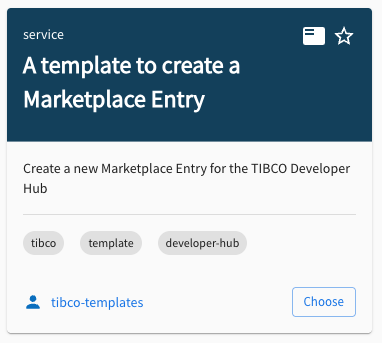

# Create Your Own Marketplace Entry


What is the TIBCO Developer Hub Marketplace?

## The TIBCO Developer Hub Marketplace: A New Era of Collaborative Development

The TIBCO Developer Hub Marketplace represents serves as a vibrant ecosystem where the entire TIBCO community can discover, share, and leverage pre-built assets that empowers developers through community.
With the Marketplace, you can now instantly access:

- Pre-built **Templates** that jump start new projects
- **Import Flows** that seamlessly bring existing TIBCO code into the Developer Hub
- **Documentation** to guide implementation
- **Real-world Examples** that demonstrate best practices

The TIBCO Developer Hub Marketplace empowers developers to build, share, and innovate together in this era of AI driven integration. As our community grows and contributes, the Marketplace will become an increasingly valuable resource for accelerating digital transformation initiatives. We are inviting you to explore the Marketplace today and join us in creating your own Marketplace Entry:

What is a Marketplace Entry ? A Marketplace Entry in essence is a **Developer Hub Template:**

```yaml
apiVersion: scaffolder.backstage.io/v1beta3
kind: Template
metadata:
  name: mp-entry-template-to-create-template
  title: Template to Create a Template
```

Which has the tag **devhub-marketplace** :

```yaml
  tags:
    - devhub-marketplace
    - tibco
    - developer-hub
    - create-template
```

The **type of marketplace entry** is defined by the type field in the spec:

```yaml
spec:
  owner: group:default/marketplace-entries-group
  type: import-flow
```

Marketplace Entry specific details are described in the **tibco.developer.hub/marketplace** field:

```yaml
  tibco.developer.hub/marketplace:
    isNew: false
    popularity: 0
    isMultiInstall: false
    imageURL: ""
    moreInfo:
      - text: TIBCO
        url: https://www.tibco.com/
        icon: star
```

Here you can set links and a custom image URL.

**Note:** Currently the popularity field and isMultiInstall are not used yet.

# Create New Marketplace Entry Template

[Open Template to Create Marketplace Entry](/tibco/hub/create/templates/default/marketplace-entry-template).



With this document comes a [template](/tibco/hub/create?filters%5Bkind%5D=template&filters%5Buser%5D=all&limit=20)
to create a new Marketplace Entry, these are the input fields:

- **Name**: The name of the Marketplace Entry, which will be used as the unique identifier.
- **Title**: The title of the Marketplace Entry.
- **Description**: A brief description of the Marketplace Entry.
- **Type**: The type of the Marketplace Entry, such as `sample`, `import-flow`, `template`, or `document`.
- **Catalog URL**: The URL of the catalog entry to be used in the Marketplace Entry.
- **Image URL**: The URL of the image to be used in the Marketplace Entry (leave empty for default image).
- **License URL**: The URL of the license for the Marketplace Entry (default is TIBCO's license).
- **Owner**: The owner of the Marketplace Entry, which can be a group or user.

### Catalog URL
The Catalog URL is the URL of the catalog entry that will be used in the Marketplace Entry.
This is the most important field, as it **defines the content of the Marketplace Entry.**
This file can contain anything that you want to put in the marketplace, literally anything can be shared if you make this a template and point the template to those sources.

For full documentation on the Marketplace, see the [Marketplace Documentation](https://docs.tibco.com/pub/platform-cp/1.9.0/doc/html/Default.htm#Subsystems/platform-devhub/User-Guide/marketplace.htm)


