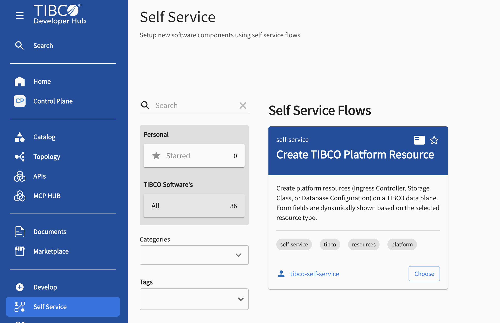
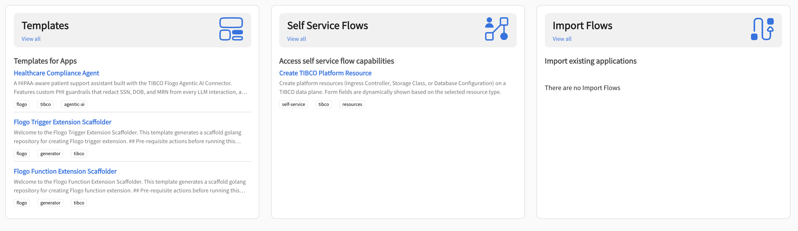
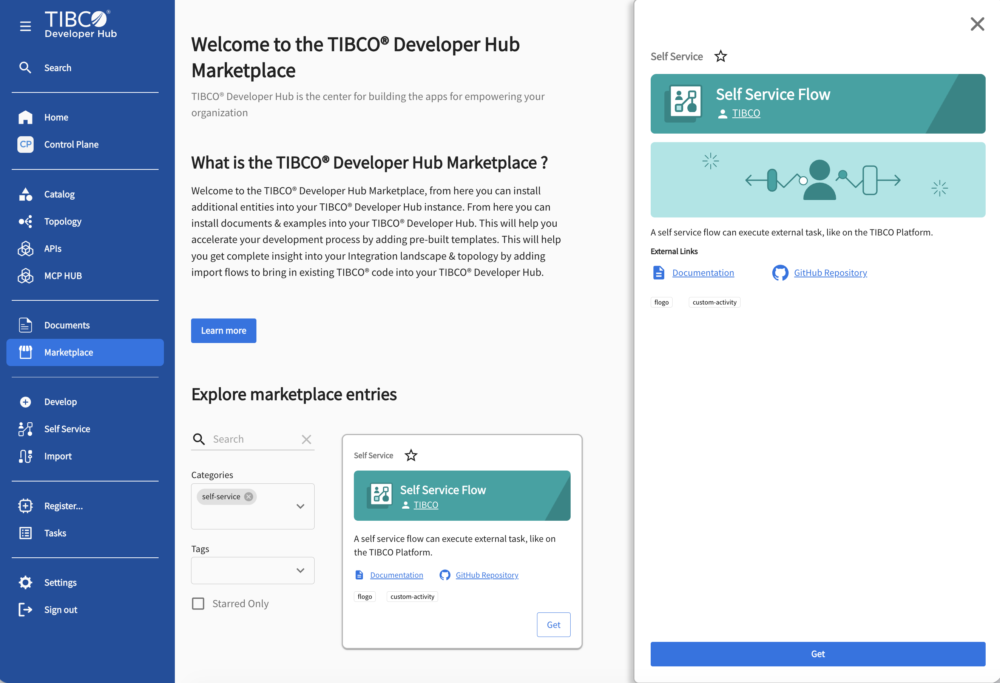
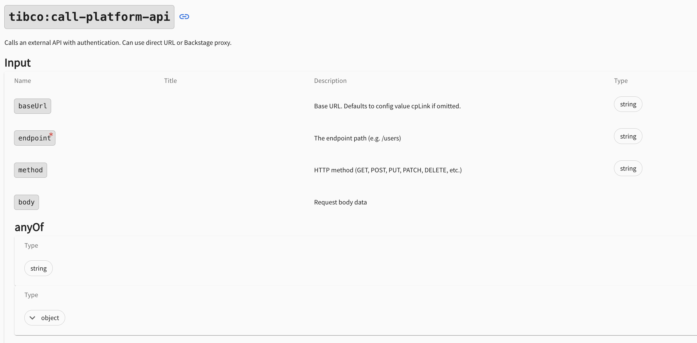
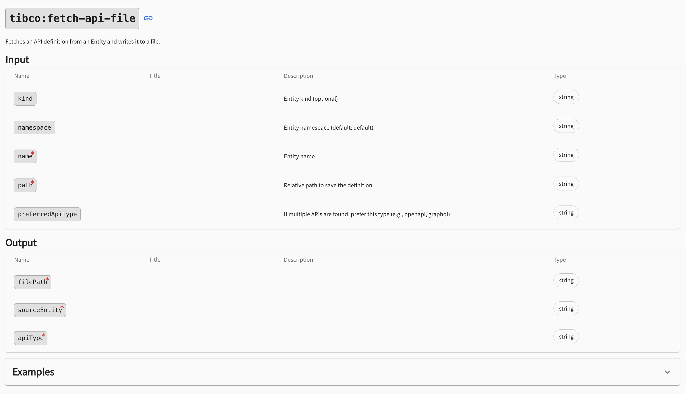
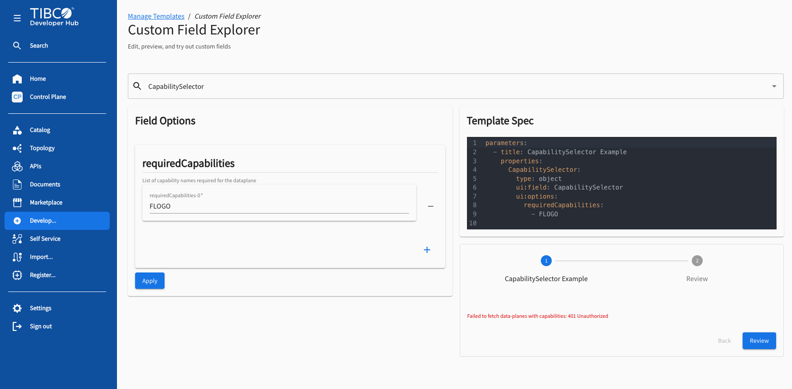

# Create a Self Service Flow

Where a template scaffolds a new project and an import flow brings existing code into the
catalog, a **self service flow** acts directly on the **TIBCO Platform**: it executes a series
of platform API calls — build an app, deploy it, provision a capability, expose an endpoint —
straight from a form in the TIBCO Developer Hub. This guide explains what a self service flow
is, the custom actions and form fields that make it work, and how to build, register, and run
one.

## What is a self service flow?

Self service flows give you the building blocks to design **end-to-end flows that perform a
series of actions on the TIBCO Platform**. Each step is a modular task executed through the
platform APIs, which makes self service flows an alternative to traditional pipeline workflows.
Typical examples:

- automating the **direct deployment of applications** on the platform,
- **importing platform applications** into the Developer Hub, and
- enabling the **setup of B2B partners**.

Because everything runs through the platform APIs, a flow can chain checks and actions that a
developer would otherwise click through manually in the Control Plane: *is the Flogo capability
provisioned on this data plane? If not, provision it. Then build, deploy, scale, and expose the
app — and register it in the catalog.*

## Where self service flows appear

The Developer Hub gives self service flows their own surfaces:

- a dedicated **Self Service** page (left navigation) that lists all registered self service
  flows, with search, filters, and favorites,
- a **Self Service Flows** card on the home page that also displays your bookmarked favorites,
  and
- a dedicated **Self Service** category in the **Marketplace**.







## A self service flow is a template

Technically, a self service flow is the same entity as a template: a Backstage
`scaffolder.backstage.io/v1beta3` `Template`. Two things make it a self service flow:

- **`spec.type: self-service`**, which routes it to the Self Service page, and
- the **`self-service` tag**.

```yaml
apiVersion: scaffolder.backstage.io/v1beta3
kind: Template
metadata:
  name: self-service-build-deploy-flogo-app
  title: Build & Deploy Flogo App
  description: 'Builds and deploys a Flogo application to a dynamically selected TIBCO Data Plane.'
  tags:
    - self-service      # <- this tag marks it as a self service flow
    - tibco
    - flogo
spec:
  owner: group:default/tibco-self-service
  type: self-service    # <- this type routes it to the Self Service page
```

Because it is a template, everything from the
**[Template Tutorial](/docs/default/System/create-template)** applies here too: the form is
defined in `parameters`, the work happens in `steps`, and you can edit and preview it in the
Template Editor. This guide focuses on what is *different*: the platform-API actions and the
platform-aware form fields.

## The custom actions

Custom scaffolder actions for self service flows are integrated as a dedicated backend plugin
module. It registers template actions tailored for TIBCO Platform workflows: managing workspace
files, executing authenticated platform API calls, and fetching API definitions from the
catalog. You can browse all of them, with their full input and output schemas, on the
**[Installed Actions](/tibco/hub/create/actions)** page.

### `tibco:call-platform-api`

The heart of a self service flow. It calls any TIBCO Platform API with robust authentication
support and handles diverse payload types: structured JSON, multipart forms for file uploads,
and standard URL-encoded data. MIME types are detected automatically from file extensions (such
as `.zip`, `.json`, or `.flogo`). If no HTTP method is given, it defaults to `GET`.



**Input parameters**

| Param | Type | Required | Description |
|-------|------|----------|-------------|
| `endpoint` | string | Yes | Path to the API endpoint |
| `method` | string | No | HTTP verb (default: GET) |
| `body` | object | No | JSON payload for the request |
| `filePath` | string | No | Workspace file for upload |
| `baseUrl` | string | No | Base URL override (e.g. a data plane URL) |

**Output**

| Field | Type | Description |
|-------|------|-------------|
| `status` | number | The numeric HTTP response code |
| `data` | object | The parsed JSON response payload |
| `baseUrl` | string | The fully resolved URL used for the API call |

The base URL and the authentication token are resolved through a tiered priority system, so the
same flow works in local development and in production:

**Base URL determination**

| Priority | Source | Protocol |
|----------|--------|----------|
| 1 | `baseUrl` (action input) | `https://` |
| 2 | `CP_DOMAIN` (environment variable) | `http://` (internal) |
| 3 | `cpLink` (app config) | `https://` |

**Authentication token logic**

| Priority | Token source |
|----------|--------------|
| 1 | `cpToken` (action input) |
| 2 | `cpToken` (template secrets) |
| 3 | `TIBCOPlatformToken` (app config) |

```yaml
  steps:
    - id: get-status
      action: tibco:call-platform-api
      input:
        endpoint: public/v1/health
        requireAuth: false
```

### `tibco:file:write`

Writes string content directly to a file in the active scaffolder workspace. Useful for saving
an API response so a later step can query it, or for turning form input into an uploadable file.

| Param | Type | Required | Description |
|-------|------|----------|-------------|
| `filePath` | string | Yes | Target workspace path |
| `content` | string | Yes | String payload to write |
| `overwrite` | boolean | No | Replace an existing file |

The output reports the full destination `filePath` and the written `size` in bytes.

```yaml
  steps:
    - id: create-config
      action: tibco:file:write
      input:
        filePath: app-config.json
        content: '{"env": "prod"}'
```

### `tibco:fetch-api-file`

Retrieves an API definition from the Developer Hub catalog and stores it in the scaffolder
workspace. It works with *API* entities and can resolve definitions from *Component* entities
via the `providesApis` field.



**Input parameters**

| Parameter | Type | Required | Default | Description |
|-----------|------|----------|---------|-------------|
| `name` | string | Yes | — | Entity identifier (e.g. `my-api`) |
| `path` | string | Yes | — | Workspace destination path |
| `kind` | string | No | — | Override for entity kind |
| `namespace` | string | No | `default` | Entity namespace |
| `preferredApiType` | string | No | — | Preferred type when an entity provides multiple APIs |

**Output fields**

| Field | Type | Description |
|-------|------|-------------|
| `filePath` | string | Full path to the written definition |
| `sourceEntity` | string | Reference of the source API entity |
| `apiType` | string | Detected API type (e.g. `openapi`) |

```yaml
  steps:
    - id: fetch-api
      name: Fetch API Definition
      action: tibco:fetch-api-file
      input:
        name: my-rest-api
        path: api-definition.yaml
```

### `tibco:extract-parameters`

Self service flows also reuse the extraction action from import flows — typically with the
`json` type to pull values (a version number, a connector tag) out of a saved platform API
response. See the **[Import Flow Tutorial](/docs/default/System/create-import-flows)** for the
full reference. Remember that every extracted parameter is an **array**, so reference the first
element: `${{ steps.extract.output.value[0] }}`.

## The custom form fields

The Developer Hub provides custom scaffolder **field extensions** tailored for the TIBCO
Platform. Backed by the platform API backend (`scaffolder-backend-module-platform-api`), they
fetch and filter live platform data while the user fills in the form, so template inputs are
both valid and contextually relevant.

| Extension name | `ui:field` value | Description |
|----------------|------------------|-------------|
| DataplaneSelectorExtension | `DataplaneSelector` | A dropdown menu for selecting a TIBCO Dataplane. |
| CapabilitySelectorExtension | `CapabilitySelector` | A multi-functional selector that filters targets by health status. |

You can try both out in the **Custom Field Explorer** (Develop → ellipsis menu → Custom Field
Explorer).



### `CapabilitySelector` — combined selector logic

The `CapabilitySelector` provides a consolidated interface for picking a data plane based on
functional requirements. It automates several tasks:

1. Retrieves the list of all registered platform Dataplanes.
2. Validates the status of capability instances via platform API health checks.
3. Filters the list to show only Dataplanes where all required capabilities are healthy.
4. Automatically selects the first eligible Dataplane and resolves its deployment host and URL.

```yaml
  parameters:
    - title: Deployment Details
      properties:
        deploymentTarget:
          title: Select Deployment Target
          type: object
          ui:field: CapabilitySelector
          ui:options:
            requiredCapabilities:
              - FLOGO
              - BWCE
```

The selected value is a structured object with the routing and identity information your steps
need:

| Property | Type | Description |
|----------|------|-------------|
| `dataplaneId` | string | The unique identifier of the chosen Dataplane |
| `capabilityId` | string | The instance ID targeted for the deployment |
| `dataplaneUrl` | string | The resolved base URL for API interactions |

Use it directly in your steps:

```yaml
  steps:
    - id: deploy
      action: tibco:call-platform-api
      input:
        baseUrl: ${{ parameters.deploymentTarget.dataplaneUrl }}
        endpoint: 'public/v1/dp/builds'
```

If multiple capabilities are listed, the resolution logic prioritizes the first entry of type
*PLATFORM* to determine the deployment URL; additional *INFRA* capabilities are used only for
filtering, to ensure the environment meets all prerequisites.

**Error states**

| Condition | User notification |
|-----------|-------------------|
| Zero matches found | No data-planes with the required capabilities are available. |
| Backend API error | Specific error details returned from the platform request. |
| Invalid config | No required capabilities specified in template configuration. |

## Developer environment setup

To develop and test flows against a Control Plane from a local Developer Hub, configure the
following in your local app-config YAML:

```yaml
cpLink: 'https://control-plane.local'
TIBCOPlatformToken: 'dev-token-string'
```

| Configuration key | Required | Description |
|-------------------|----------|-------------|
| `cpLink` | Yes | Default URL for platform interactions |
| `TIBCOPlatformToken` | Yes | Static bearer token for development |

## A complete example

The **Build & Deploy Flogo App** flow shows how the pieces fit together. The form collects the
app name and configuration (step 1), the deployment target via `CapabilitySelector` (step 2),
and a repository location (step 3). The steps then:

1. **Check the data plane** — `tibco:call-platform-api` calls `public/v1/dp/flogoversions` on
   the selected data plane.
2. **Provision the Flogo capability if missing** — fetch available versions from the Control
   Plane, save the response with `tibco:file:write`, extract the latest version with
   `tibco:extract-parameters` (JSONPath), and `POST` to provision it. Each of these steps uses
   an `if:` condition so they only run when needed:
   ```yaml
    - id: provision-flogo-version
      name: Provision Flogo Version
      if: ${{ steps.test_connection.output.data.totalBuildtypes == 0 }}
      action: tibco:call-platform-api
      input:
        baseUrl: ${{ parameters.deploymentTarget.dataplaneUrl }}
        endpoint: 'public/v1/dp/flogoversions/${{ steps["extract-latest-flogo-version"].output.latest_flogo_version[0] }}'
        method: POST
   ```
3. **Install the General connector if missing** — same check / extract / `POST` pattern against
   `public/v1/dp/connectors`.
4. **Build the app** — write the user-supplied Flogo JSON to the workspace, then upload it as
   multipart form data:
   ```yaml
    - id: build_flogo_app
      name: Building Flogo App
      action: tibco:call-platform-api
      input:
        baseUrl: ${{ parameters.deploymentTarget.dataplaneUrl }}
        endpoint: 'public/v1/dp/builds'
        method: POST
        filePath: ${{ steps['write-custom-file'].output.filePath }}
        contentType: 'formData'
        formFieldName: ${{ parameters.filename }}
        body:
          request:
            buildName: ${{ parameters.flogo_app_name + "-build" }}
   ```
5. **Deploy and expose** — `POST` the build to `public/v1/dp/builds/{buildId}/deploy`, then make
   the endpoint public via `public/v1/dp/apps/{appId}/endpoints/public`.
6. **Link and register** — link the deployed app to the Developer Hub in the Control Plane,
   generate a `catalog-info.yaml` from a skeleton with `fetch:template`, publish it to GitHub,
   and register it with `catalog:register`.

The full flow definitions are available in the Marketplace as **Build & Deploy Flogo App** and
**Build & Deploy BW5CE App** — get them and open the template files to study or copy the
complete YAML.

## Registering and running a self service flow

Register a self service flow the same way as any template: **Register** in the left navigation
(or the **Register Existing Self Service Flow** button on the Self Service page), then point it
at the raw URL of your flow YAML. Because the template has `spec.type: self-service`, it
appears on the **Self Service** page, where anyone can hit **Choose**, fill in the form, and
watch the steps execute against the platform.

Tip: star the flows you use most — they show up in the **Personal → Starred** filter and on the
home page Self Service Flows card.
