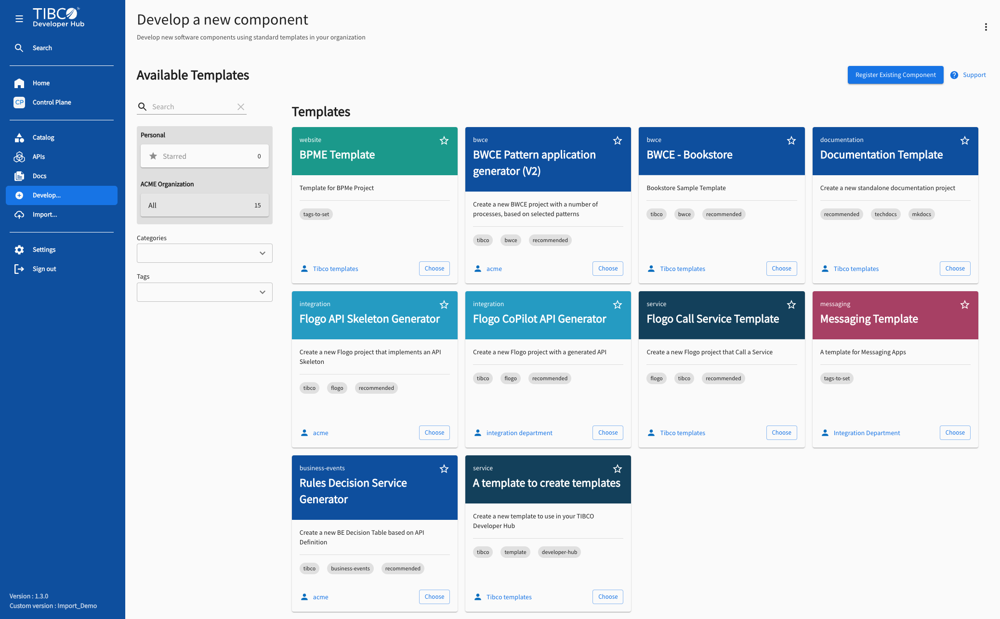
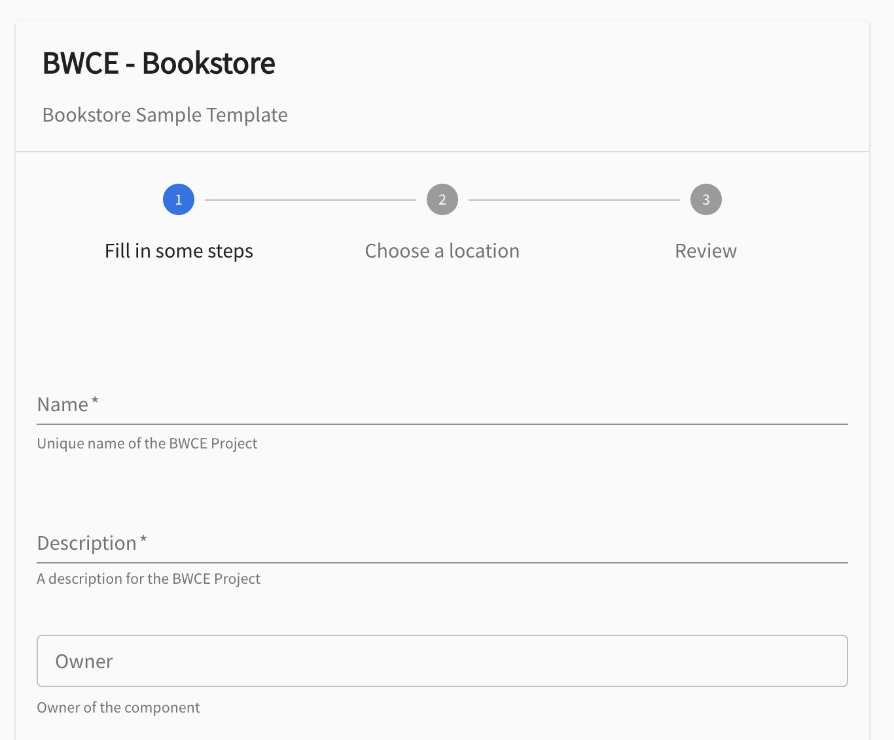
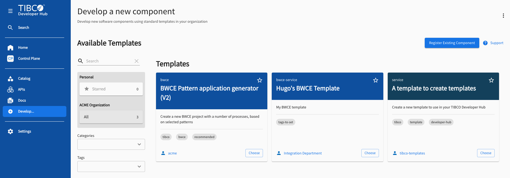
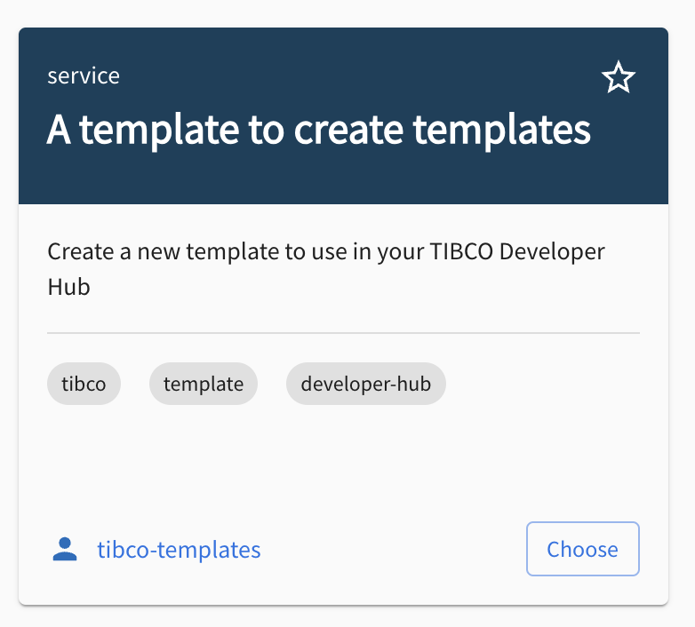

# Create a Developer Hub Template

This guide explains what a TIBCO Developer Hub template is, how it is constructed, and how
to build one by hand. It walks through the two parts you author yourself, the **form**
(the questions a user answers) and the **steps** (the actions that run on those answers).
It closes with a faster way to produce templates using an agent and skills.

## What is a template?

A template lets you set up new developer assets, such as code, tests, and pipelines, from
scratch, and it can also generate ready-to-deploy executable code. A template is defined in
a source repository as a small YAML file.

When a user runs a template, the Developer Hub:

1. Presents a **questionnaire (form)** defined in the template.
2. Runs a list of **actions (steps)** based on the answers.

The actions are where the work happens. Built-in actions fetch content and register the
result in the Software Catalog, and you can also implement your own custom actions, for
example registering an API or triggering a Jenkins job.

To see every template available in your instance, go to **Develop** in the left navigation.
Each card shows the template's type, description, owner, and tags. You can search, star
favorites, and filter by category and tag.



## How a template is constructed

A template is a single Backstage `Template` entity with three meaningful parts:

- **`metadata`** — the identity of the template: `name`, `title`, `description`, and `tags`.
  Tags also control *where* the template appears (a `devhub-marketplace` tag lists it under
  the Marketplace, an `import-flow` tag lists it under Import Flows, anything else lists it
  under Develop).
- **`parameters`** — the **form**: the questions the user answers before the template runs.
- **`steps`** — the **actions**: what the scaffolder executes, in order, using the answers.

Conceptually the flow is:

> **Template sources** → **Questionnaire (form)** → **Actions** (code generation, Developer Hub registration, custom)

A minimal template skeleton looks like this:

```yaml
apiVersion: scaffolder.backstage.io/v1beta3
kind: Template
metadata:
  name: my-template
  title: My Template
  description: A one-line description shown on the template card
  tags:
    - tibco
    - recommended
spec:
  owner: tibco-templates
  type: service

  parameters:
    # the form (see below)

  steps:
    # the actions (see below)
```

### Template types and their colors

The `spec.type` field classifies the template and determines the colour of its card header in
the Develop view, which makes it easy to scan the catalog at a glance. The standard types and
their colours are:

| Type | Card colour | Hex |
|------|-------------|-----|
| `service` | <span style="display:inline-block;width:16px;height:16px;background:#13405B;border:1px solid #ccc;border-radius:3px;vertical-align:middle"></span> | `#13405B` |
| `library` | <span style="display:inline-block;width:16px;height:16px;background:#7DC95E;border:1px solid #ccc;border-radius:3px;vertical-align:middle"></span> | `#7DC95E` |
| `website` | <span style="display:inline-block;width:16px;height:16px;background:#1B998B;border:1px solid #ccc;border-radius:3px;vertical-align:middle"></span> | `#1B998B` |
| `integration` | <span style="display:inline-block;width:16px;height:16px;background:#259BC2;border:1px solid #ccc;border-radius:3px;vertical-align:middle"></span> | `#259BC2` |
| `messaging` | <span style="display:inline-block;width:16px;height:16px;background:#A74064;border:1px solid #ccc;border-radius:3px;vertical-align:middle"></span> | `#A74064` |

You can use other type values too (for example `bwce` or `flogo`); these render with a default
colour. Pick the type that best describes what the template produces.

## Building the form (parameters)

The `parameters` section defines the form. Each entry in the list becomes a **page** in the
wizard, with a `title`, an optional `required` list, and a set of `properties`. Each property
is one input field.

The form is built on [react-jsonschema-form (RJSF)](https://github.com/rjsf-team/react-jsonschema-form),
which renders a form from a JSON Schema. Your template's `parameters` are exactly that schema,
just written in YAML. A practical way to design a form is to prototype it in the
[RJSF playground](https://rjsf-team.github.io/react-jsonschema-form/), where you can edit the
schema and see the form update live, and then convert the resulting JSON into YAML and paste it
under `parameters` in your template.

```yaml
  parameters:
    - title: Fill in some steps
      required:
        - name
      properties:
        name:
          title: Name
          type: string
          description: Unique name of the component
          ui:field: EntityNamePicker
          ui:autofocus: true
        description:
          title: Description
          type: string
          description: A description for the component
        owner:
          title: Owner
          type: string
          description: Owner of the component
          ui:field: OwnerPicker
          ui:options:
            allowedKinds:
              - Group
    - title: Choose a location
      required:
        - repoUrl
      properties:
        repoUrl:
          title: Repository Location
          type: string
          ui:field: RepoUrlPicker
          ui:options:
            allowedHosts:
              - github.com
```

The screenshot below shows how that YAML is turned into a form at runtime. Each entry in
`parameters` becomes a numbered step in the wizard at the top (`Fill in some steps` and
`Choose a location`, plus an automatic `Review` step). Within a step, every property under
`properties` becomes a field: `name` and `description` render as text inputs, their `title`
becomes the label and their `description` becomes the helper text beneath it, and the
`required` list adds the asterisk (`*`). The `owner` property uses `ui:field: OwnerPicker`,
so instead of a plain text box it renders as a catalog picker limited to Groups.



Some commonly used field widgets:

- **`EntityNamePicker`** — validates a unique catalog entity name.
- **`OwnerPicker`** — pick an owning Group or User from the catalog.
- **`RepoUrlPicker`** — pick a Git host, organization, and repository for the publish step.
- **`Secret`** (`ui:field: Secret`) — for sensitive values. Secrets are protected and not
  exposed through the REST endpoint. Do not pass a secret as an input to the `fetch:template`
  action, because that prints it to the log and commits it to Git; instead pass the secret
  directly to the service that needs it after the fetch step. Do not combine
  `ui:widget: password` with `ui:field: Secret`.

### Edit and preview forms in the Template Editor

You do not have to guess how a form will render. The Developer Hub ships a live
**Template Editor** where you can edit, preview, and try out template forms, loading either a
sample template or one from the catalog. Your changes render immediately on the right side of
the screen, and the Custom Field Explorer lets you browse installed custom field extensions.

Open it here: [**Template Editor**](/tibco/hub/create/edit).

## Building the steps (actions)

The `steps` section is an ordered list of **actions** the scaffolder runs after the user
submits the form. Each step has an `id`, a `name`, an `action`, and an `input` block. You
reference answers from the form with `${{ parameters.<name> }}` and outputs from earlier
steps with `${{ steps.<id>.output.<field> }}`.

```yaml
  steps:
    - id: fetch
      name: Fetch Skeleton
      action: fetch:template
      input:
        url: ./skeleton
        values:
          name: ${{ parameters.name }}
          description: ${{ parameters.description }}
          owner: ${{ parameters.owner }}
          destination: ${{ parameters.repoUrl | parseRepoUrl }}

    - id: publish
      name: Publish
      action: publish:github
      input:
        description: This is ${{ parameters.name }}
        repoUrl: ${{ parameters.repoUrl }}

    - id: register
      name: Register
      action: catalog:register
      input:
        repoContentsUrl: ${{ steps.publish.output.repoContentsUrl }}
        catalogInfoPath: '/catalog-info.yaml'
```

The three actions above are the typical building blocks:

- **`fetch:template`** reads the files in `./skeleton`, runs them through templating
  (substituting the `values` you pass in), and stages the result.
- **`publish:github`** creates and pushes a new Git repository.
- **`catalog:register`** registers the new component in the Software Catalog so it appears
  under Catalog.

You can make a step conditional with `if:` (for example, `if: ${{ not parameters.debug }}`
to skip side-effects while testing), and you can declare output `links` so the user gets a
button to the new repository and catalog entry when the run finishes.

### See every available action

Templates come with many installed actions for fetching content, registering in the catalog,
and creating and publishing a Git repository, and your administrator can install custom ones.
To see the full list, with the inputs and outputs each action accepts, open the
**Installed Actions** page:

[**Installed Actions**](/tibco/hub/create/actions).

After a template runs, the [**Task List**](/tibco/hub/create/tasks) shows the history of every
run, its status, the template used, and the owner, which is useful for debugging a failed run.

## A complete example

Putting the form and steps together with an output block:

```yaml
apiVersion: scaffolder.backstage.io/v1beta3
kind: Template
metadata:
  name: bwce-orders
  title: BWCE - Orders
  description: Scaffold a new BWCE orders service
  tags:
    - tibco
    - bwce
    - recommended
spec:
  owner: tibco-templates
  type: bwce

  parameters:
    - title: Fill in some steps
      required:
        - name
      properties:
        name:
          title: Name
          type: string
          description: Unique name of the component
          ui:field: EntityNamePicker
          ui:autofocus: true
        description:
          title: Description
          type: string
          description: A description for the component
        owner:
          title: Owner
          type: string
          ui:field: OwnerPicker
          ui:options:
            allowedKinds:
              - Group
    - title: Choose a location
      required:
        - repoUrl
      properties:
        repoUrl:
          title: Repository Location
          type: string
          ui:field: RepoUrlPicker
          ui:options:
            allowedHosts:
              - github.com

  steps:
    - id: fetch
      name: Fetch Skeleton
      action: fetch:template
      input:
        url: ./skeleton
        values:
          name: ${{ parameters.name }}
          description: ${{ parameters.description }}
          owner: ${{ parameters.owner }}
          destination: ${{ parameters.repoUrl | parseRepoUrl }}

    - id: publish
      name: Publish
      action: publish:github
      input:
        description: This is ${{ parameters.name }}
        repoUrl: ${{ parameters.repoUrl }}

    - id: register
      name: Register
      action: catalog:register
      input:
        repoContentsUrl: ${{ steps.publish.output.repoContentsUrl }}
        catalogInfoPath: '/catalog-info.yaml'

  output:
    links:
      - title: Repository
        url: ${{ steps.publish.output.remoteUrl }}
      - title: Open in catalog
        icon: catalog
        entityRef: ${{ steps.register.output.entityRef }}
```

The `./skeleton` folder holds the files `fetch:template` copies. It should always contain a
`catalog-info.yaml` (this is what `catalog:register` ingests), plus whatever source the
template produces. Skeleton files are run through templating, so they can use
`${{ values.name }}` substitutions.

## Running your template

1. **Register the template** so the Developer Hub can see it. Go to **Develop**, click
   **Register Existing Component**, and provide the URL to your template's entity file (or a
   source repository the wizard will scan). The wizard previews the entities and adds them to
   the catalog.
2. **Run it.** Open **Develop**, click **Choose** on your template, fill in the form, and
   click **Create**. The selected actions run, build the source repository, and register the
   new component.
3. **Open the result** from the run page via **Open in Catalog**, and review history in the
   Task List.



There is also a ready-made starting point: the
[**Template to Create a Template**](/tibco/hub/marketplace?filters%5Bkind%5D=template&filters%5Btags%5D=create-template),
which you can install from the Marketplace and use to scaffold a new template you can edit.



## Tip: generate templates with an agent and skills

Writing the YAML by hand is useful for understanding how templates work, but you can also let a
coding agent do it for you using a skill. The `create-template` skill drives the agent through a
short set of questions (slug, title, type, owner, tags, parameters, publish target) and then
generates the full `Template` entity YAML, a starter `skeleton/` with its `catalog-info.yaml`,
and the local catalog wiring so the template shows up in the picker after a backend restart. It
also adds a `debug` flag so you can safely test a run without publishing a real repository. This
is the fastest way to go from an idea to a working, registered template.
