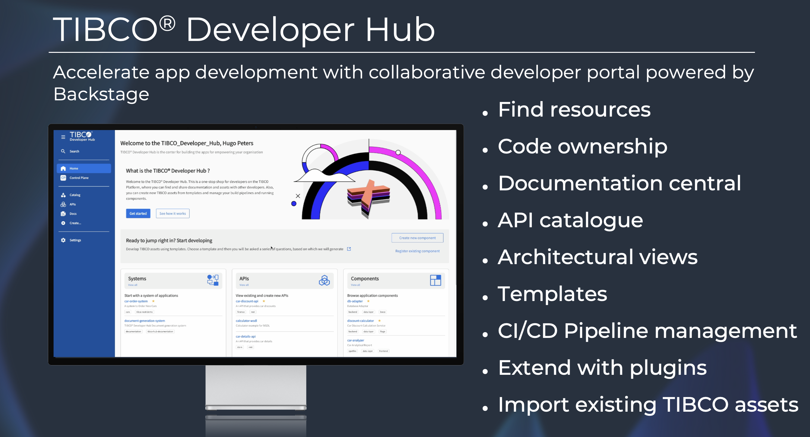

# Welcome to the TIBCO Developer Hub

## Your Gateway to Accelerated Development

Welcome to the TIBCO Developer Hub, your centralized command center for building innovative digital services faster and more efficiently. Built on the proven foundation of Spotify Backstage, the Developer Hub transforms how your development teams discover, create, and deploy applications within the TIBCO ecosystem.

## What is the TIBCO Developer Hub?

The TIBCO Developer Hub is a comprehensive developer portal that addresses one of the most persistent challenges in enterprise development: **finding and understanding the assets you need to build exceptional applications**. Rather than spending hours searching through scattered documentation or reinventing components that already exist, the Developer Hub puts everything at your fingertips.

First of all the TIBCO Developer Hub is a **portal** that acts as a **single pane of glass** for everything related to your TIBCO Development. It is not the intention to replace any of your existing systems it rather brings it all together in one place.

## Core Concepts

### 🔍 **Find Resources**
Your centralized catalog where developers can quickly locate everything they need: APIs, applications, templates, databases, EMS queues, and both TIBCO and non-TIBCO components. The Developer Hub eliminates the time-consuming hunt for existing assets, preventing developers from wasting hours searching or accidentally building duplicates of components that already exist.

### 👥 **Code Ownership**
Every component in the Developer Hub has clear ownership assigned, so developers immediately know who to contact with questions or issues. This is especially valuable during production incidents at 2 AM when you need to quickly identify the responsible team member for a failing component.

### 📚 **Documentation Central**
All documentation lives in one place, directly linked to each component. Whether it's technical specifications, API definitions, or implementation details, everything is accessible from the component's dedicated page. Automatically generate documentation from TIBCO source code, ensuring documentation stays current with the actual implementation.

### 🔗 **API Catalogue**
Comprehensive API inventory supporting multiple formats including REST, SOAP, GraphQL, and gRPC. Unlike traditional API catalogs that only show exposed APIs, the Developer Hub also displays the APIs your applications consume, giving you complete visibility into both inbound and outbound API dependencies.

### 🏗️ **Architectural Views**
Visual relationship mapping that reveals how all your components connect and depend on each other. See how integration flows connect to databases, how processes use backend systems, and how UIs consume specific APIs. This **integration topology view** enables powerful impact analysis—understand what gets affected when you need to change a component or system.

### 📋 **Templates**
Accelerate development with standardized, reusable application templates that embed your enterprise security and governance policies. Templates ask configuration questions and generate complete applications from Business Works projects to Flogo flows that developers can immediately start customizing with business logic rather than spending time on setting up new projects.

### ⚙️ **CI/CD Pipeline Management**
Visualize and manage your continuous integration and deployment pipelines directly from component pages. Whether you use GitHub Actions, Jenkins, Azure Pipelines, or other tools, you can monitor job status, view logs, and even restart builds without leaving the Developer Hub context.

### 🧩 **Extend with Plugins**
Built on the open-source Backstage framework, the Developer Hub supports 200+ community plugins for popular development tools. Extend functionality by integrating with your preferred tools for monitoring, testing, security scanning, and more—all within a unified developer experience.

### 📥 **Import Existing TIBCO Assets**
Bring your existing TIBCO landscape into the Developer Hub using **intelligent import flows**. Whether you have hundreds of BW5 projects, BW6/CE applications, Flogo flows, or EMS configurations, import flows automatically discover relationships and dependencies, creating a complete topology map of your integration architecture without manual documentation effort.

## The Platform Engineering Advantage

Built on platform engineering principles, the TIBCO Developer Hub reduces cognitive load on developers by standardizing development and deployment processes. This approach can reduce new developer onboarding time while helping experienced developers deliver projects faster.

## Ready to Get Started?

The TIBCO Developer Hub represents a fundamental shift from reactive, search-based development to proactive, discovery-driven creation. Whether you're building your first integration or architecting complex enterprise solutions, the Developer Hub provides the foundation for accelerated, confident development.
