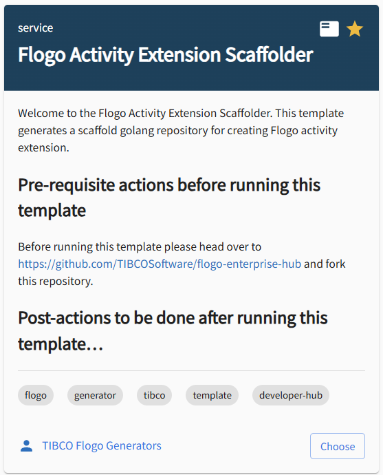
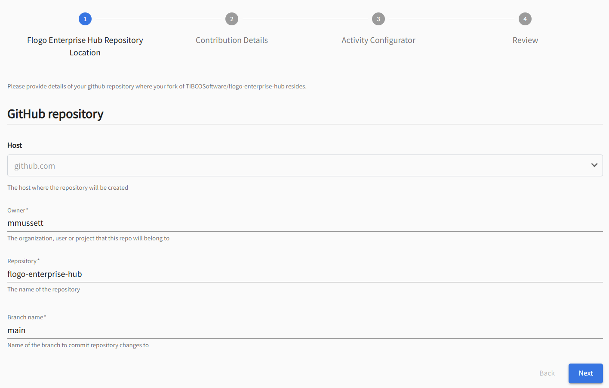
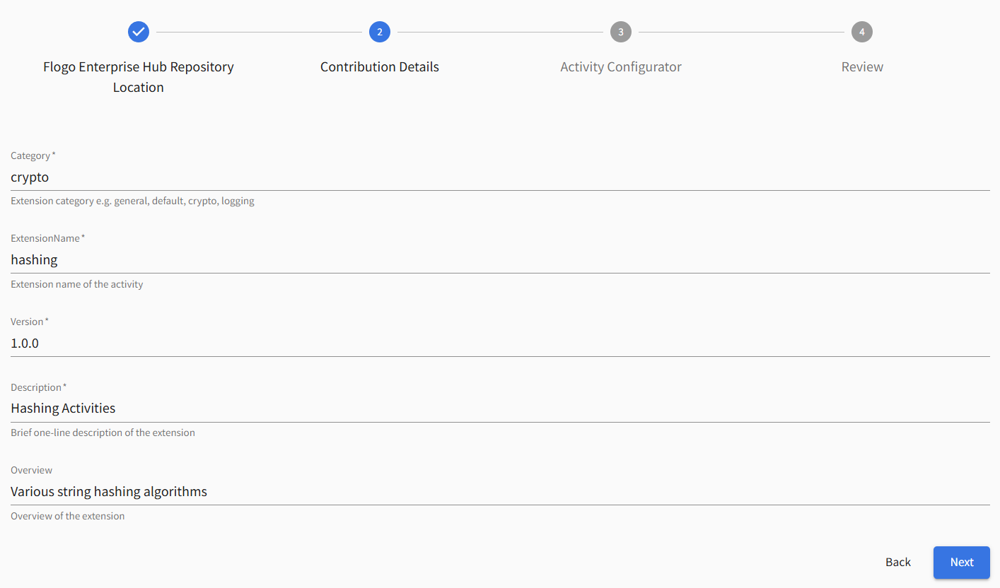
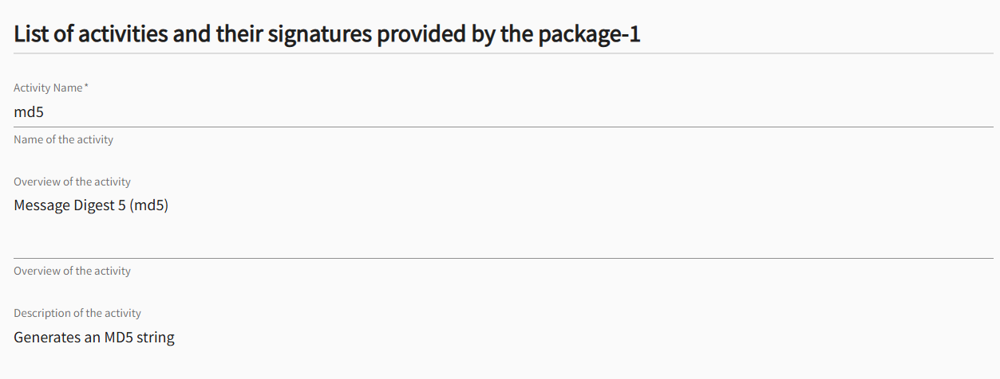
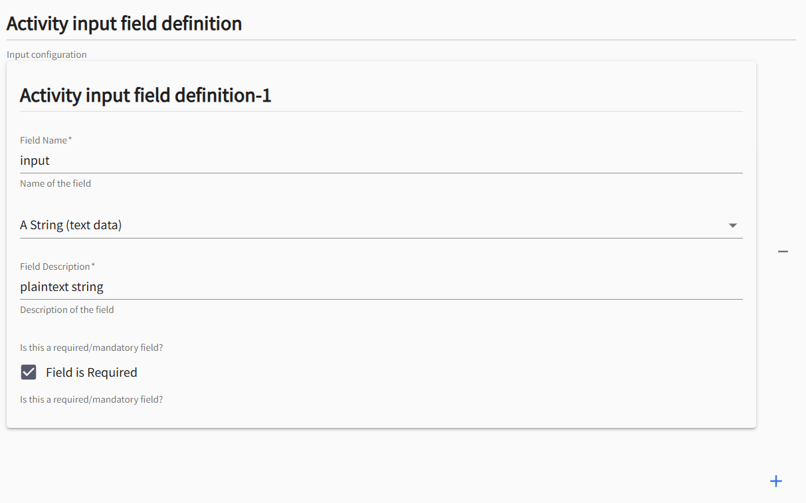
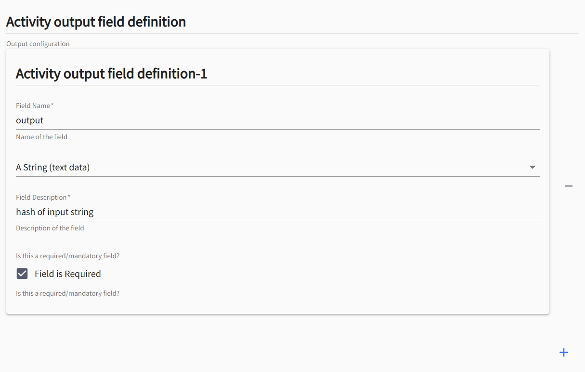
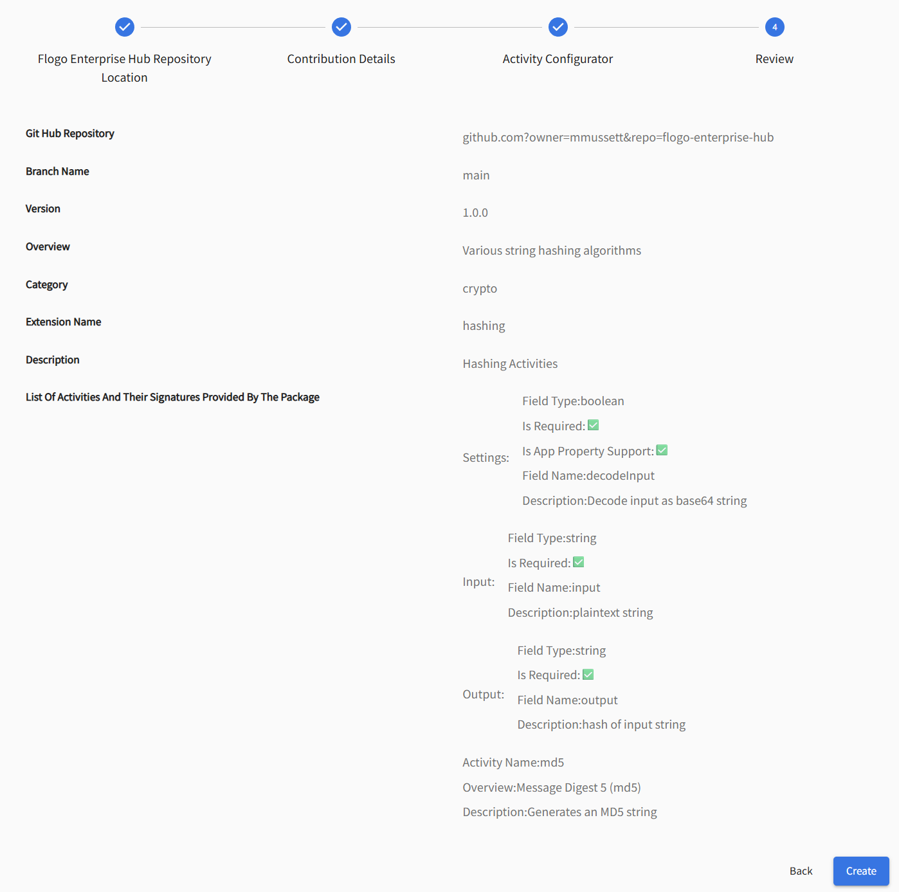
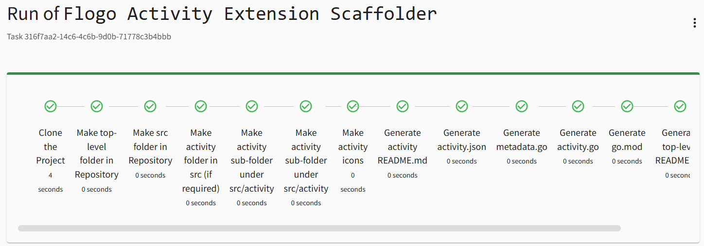

# FLOGO ACTIVITY EXTENSION SCAFFOLDER


## About this Template

This template is used to scaffold a Flogo Activity Extension. It will populate the necessary structure and files required to implement a Flogo Activity component that then can be used by Flogo. 

Navigate to the Develop a new component section under TIBCO Developer Hub. You will see a tile named 'Flogo Trigger Extension Scaffolder':



## What you’ll need to do first...

### Get yourself a Github Account (if you don't have one)
TIBCO Developer Hub templates uses and store your artefacts in Github. You'll need your own Github Account to be able to utilise the Flogo Trigger Extension Scaffolder.

### Fork the Official TIBCO Flogo Enterprise Repository
Head over to [Flogo Enterprise Github Repository](https://github.com/TIBCOSoftware/flogo-enterprise-hub) and fork it to your Github account. 


Any new extensions you create using the Flogo Extension Generator templates will be placed under the extensions folder in this repository.


## Running the template

### Step 1 - Flogo Enterprise Hub Repository Location



Provide values for Owner, Repository, and Branch. The template will use these values to initiate a pull from this repository.

By default, the Repository name is 'flogo-enterprise-hub'. If you've forked the official [Flogo Enterprise Github Repository](https://github.com/TIBCOSoftware/flogo-enterprise-hub) then leave the default value, else set this to whatever repository name you forked the official repository to.


### Step 2 - Contribution Details




Provide values for Category, ExtensionName, Version, Description, and Overview:

| Name | Purpose |
|------|---------|
| **Category** | is used to group all your extensions together within the IDE. Populates trigger.json |
| **ExtensionName** | Name of the extension that your trigger will take. The template will create a folder under extension using this value. |
| **Version** | Version of the extension. |
| **Description** | Description of the extension. |
| **Overview** | Overview of the extension. |

### Step 3 - Activity Configurator

The Activity Configurator step allows you to configure one or more activities for your extension.

Provide values for each Activity configuration:

| Name | Purpose |
|------|---------|
| Activity Name | This is the name of the activity. The template will create a folder under extension/<ExtensionName>/src/activity using this value. |
| Overview of the activity | Brief overview of the activity |
| Description of the activity | Description of the activity |
| Activity Settings Field Definition | Define an array of one or more setting field name and data types. |
| Activity Input Field Definition | Define an array of one or more input field name and data types. |
| Activity Output Field Definition | Define an array of one or more output field name and data types. |


Example: 

| Section | |
|--|--|
| Details |  |
| Settings |  |
| Input |  |
| Output |  |


### Step 4 - Review



### Step 5 - Run




# Using the extension

## Pull from Github Repository

Perform a git pull operation to download the extension...

```shell
$ git pull
remote: Enumerating objects: 19, done.
remote: Counting objects: 100% (19/19), done.
remote: Compressing objects: 100% (14/14), done.
remote: Total 17 (delta 1), reused 17 (delta 1), pack-reused 0 (from 0)
Unpacking objects: 100% (17/17), 7.94 KiB | 1.98 MiB/s, done.
From https://github.com/organization/flogo-enterprise-hub
   0e415c8..ff7bbaf  master     -> origin/master
Updating 0e415c8..ff7bbaf
Fast-forward
 extensions/hashing/src/README.md                               |   8 ++++++++
 extensions/hashing/src/activity/md5/README.md                  |  49 +++++++++++++++++++++++++++++++++++++++++++++++++
 extensions/hashing/src/activity/md5/activity.go                |  80 ++++++++++++++++++++++++++++++++++++++++++++++++++++++++++++++++++++++++++++++++
 extensions/hashing/src/activity/md5/activity.json              |  53 +++++++++++++++++++++++++++++++++++++++++++++++++++++
 extensions/hashing/src/activity/md5/icons/activity-icon.png    | Bin 0 -> 556 bytes
 extensions/hashing/src/activity/md5/icons/activity-icon@2x.png | Bin 0 -> 1934 bytes
 extensions/hashing/src/activity/md5/icons/activity-icon@3x.png | Bin 0 -> 2586 bytes
 extensions/hashing/src/activity/md5/metadata.go                |  74 ++++++++++++++++++++++++++++++++++++++++++++++++++++++++++++++++++++++++++
 extensions/hashing/src/go.mod                                  |   3 +++
 9 files changed, 267 insertions(+)
 create mode 100644 extensions/hashing/src/README.md
 create mode 100644 extensions/hashing/src/activity/md5/README.md
 create mode 100644 extensions/hashing/src/activity/md5/activity.go
 create mode 100644 extensions/hashing/src/activity/md5/activity.json
 create mode 100644 extensions/hashing/src/activity/md5/icons/activity-icon.png
 create mode 100644 extensions/hashing/src/activity/md5/icons/activity-icon@2x.png
 create mode 100644 extensions/hashing/src/activity/md5/icons/activity-icon@3x.png
 create mode 100644 extensions/hashing/src/activity/md5/metadata.go
 create mode 100644 extensions/hashing/src/go.mod
 ```

## Go Mod Tidy

Change directory to extensions/<extensionName>/src folder and run 'go mod tidy'.

```shell
$ go mod tidy
go: finding module for package github.com/project-flogo/core/support/log
go: finding module for package github.com/project-flogo/core/data/coerce
go: finding module for package github.com/project-flogo/core/activity
go: finding module for package github.com/project-flogo/core/data/metadata
go: found github.com/project-flogo/core/activity in github.com/project-flogo/core v1.6.14
go: found github.com/project-flogo/core/data/coerce in github.com/project-flogo/core v1.6.14
go: found github.com/project-flogo/core/data/metadata in github.com/project-flogo/core v1.6.14
go: found github.com/project-flogo/core/support/log in github.com/project-flogo/core v1.6.14
```

## Open Visual Studio Code

Open Visual Studio Code


# Generated Artefacts

The following artefacts will be generated for your activity under extensions/<extensionName>/src/activity/<activityName>:

| Filename | Purpose | 
|----------|---------|
| [activity.json](#metadata) | This file is the activity descriptor and defines the activity metadata and field signature (settings, inputs & outputs) |
| [activity.go](#logic) | Main function logic goes here |
| metadata.go | Structure mapping logic that defines the golang Structs and Functions that coerce data into and out of golang Maps used by Flogo |
| icons/activity-icon.png | A 32z32 pixel png used by the activity |
| icons/activity-icon@2x.png | A 64x64 pixel png used by the activity |
| icons/activity-icon@3x.png | A 96x96 pixel png used by the activity |


# The Metadata - activity.json 

The activity.json contains the metadata for your activity. The metadata describes to Flogo what the activity is called, what the version is, it's settings, input and output structure

The configurable elements of this file are:

| Name | Purpose |
|------|---------|
| title | This appears on the activity tile within Visual Studio Plugin for Flogo. |
| version |  The version of the activity (it is recommended to use [semantic versioning](https://semver.org/) for your activity). |
| type | Must be set to flogo:activity. Do not change this. |
| name | The name of the activity (this must match the name of the folder of the activity). |
| author | The author of the trigger, by default it's set to "Created by Flogo Extension Generator", change this to your name |
| settings | An array of name/type pairs that describe global settings of the trigger (configuration that will be the same for every instance of this trigger used in your app). |
| input |  An array of name/type pairs that describes the input of the activity. |
| output | An array of name/type pairs that describes the output of the activiy. |

# Example

## Metadata <span id="metadata"><span>

```json
{
    "name": "md5",
    "version": "1.0.0",
    "type": "flogo:activity",
    "title": "md5",
    "author": "Created by Flogo Extension Generator",
    "display": {
        "category": "crypto",
        "visible": true,
        "description": "",
        "smallIcon": "icons/activity-icon@2x.png",
        "largeIcon": "icons/activity-icon@3x.png"
    },
    "feature": {
        "retry": {
            "enabled": true
        }
    },
    "ref": "github.com/organization/flogo-enterprise-hub/extensions/hashing/activity/md5",
    "settings": [

        {
            "name": "decodeInput",
            "type": "boolean",
            "required": true,
            "description": "Decode input as base64 string",
            "value":"Default_Value",
            "display": {
                "name": "decodeInput",
                "description": "Decode input as base64 string",
                "required": true,
                "type":"boolean",
                "appPropertySupport": true
            }
        }
    ],
    "inputs": [

        {
            "name": "input",
            "type": "string",
            "required": true
        }
    ],
    "outputs": [

        {
           "name": "output",
           "type": "string",
           "required": true
        }
    ]
}
```

## The logic <span id="logic"><span>


```golang
package md5

import (
        "fmt"
        "github.com/project-flogo/core/activity"
        "github.com/project-flogo/core/data/metadata"
        "github.com/project-flogo/core/support/log"
)

func init() {

        //err := activity.Register(&Activity{})
        //err := activity.Register(&Activity{}, New) to create instances using factory method 'New'

        err := activity.Register(&Activity{}, New)
        if err != nil {
                log.RootLogger().Error(err)
        }
}

var activityMd = activity.ToMetadata(&Settings{}, &Input{}, &Output{})
var activityLog = log.ChildLogger(log.RootLogger(), "hashing-md5")

//New optional factory method, should be used if one activity instance per configuration is desired
func New(ctx activity.InitContext) (activity.Activity, error) {

        s := &Settings{}
        err := metadata.MapToStruct(ctx.Settings(), s, true)
        if err != nil {
                return nil, err
        }
        ctx.Logger().Debugf("Setting: %v", s.Decodeinput)

        act := &Activity{logger: log.ChildLogger(ctx.Logger(), "hashing-md5"), activityName: "md5"}

        return act, nil
}

// Activity is an sample Activity that can be used as a base to create a custom activity
type Activity struct {
        logger       log.Logger
        activityName string
}

// Metadata returns the activity's metadata
func (a *Activity) Metadata() *activity.Metadata {
        return activityMd
}

// Cleanup method
func (a *Activity) Cleanup() error {

        return nil
}

// Eval implements api.Activity.Eval - Logs the Message
func (a *Activity) Eval(ctx activity.Context) (done bool, err error) {

        activityLog.Debugf("Executing Activity [%s] ", ctx.Name())

        input := &Input{}
        err = ctx.GetInputObject(input)
        if err != nil {
                return false, fmt.Errorf("Error while getting input object: %s", err.Error())
        }
        ctx.Logger().Debugf("Input: %v", input.Input)

    // TODO: Implement your activity logic here

        output := &Output{}
        ctx.Logger().Debugf("Output: %v", output.Output)

        err = ctx.SetOutputObject(output)
        if err != nil {
                return true, err
        }

        activityLog.Debugf("Execution of Activity [%s] " + ctx.Name() + " completed")
        return true, nil
}
```
