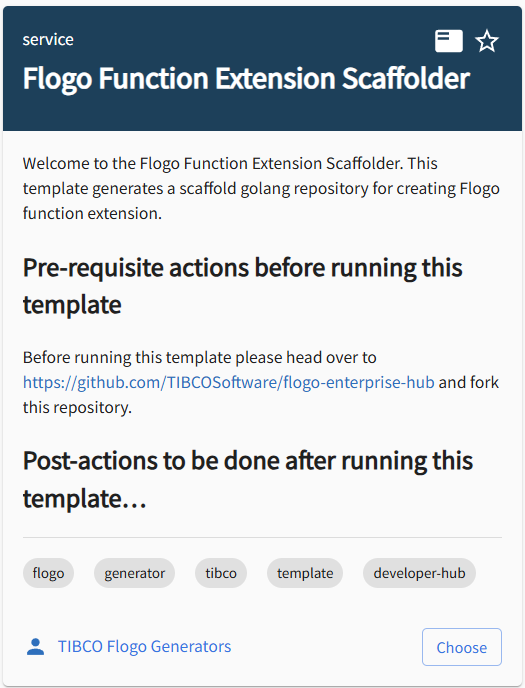
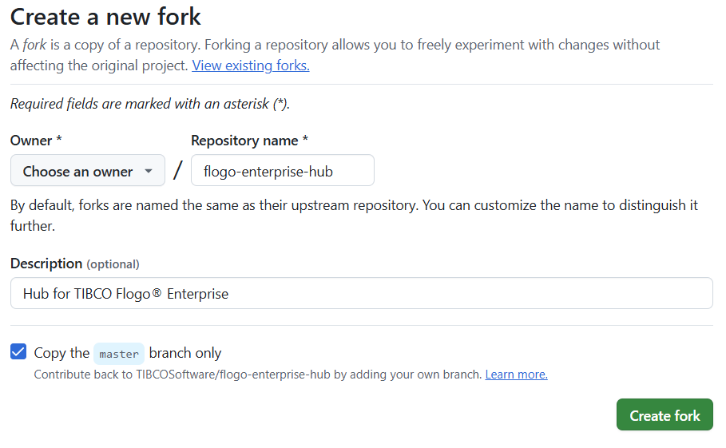
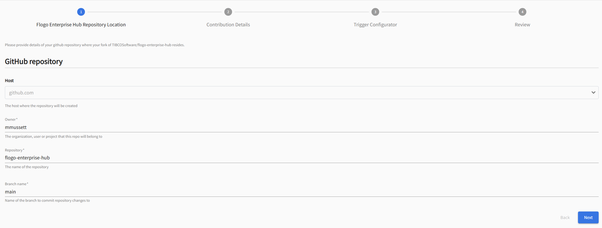
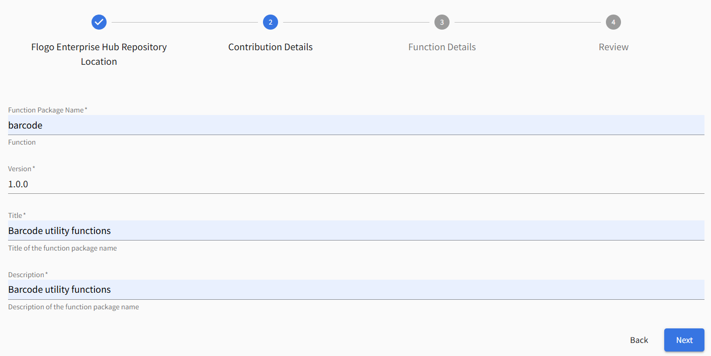
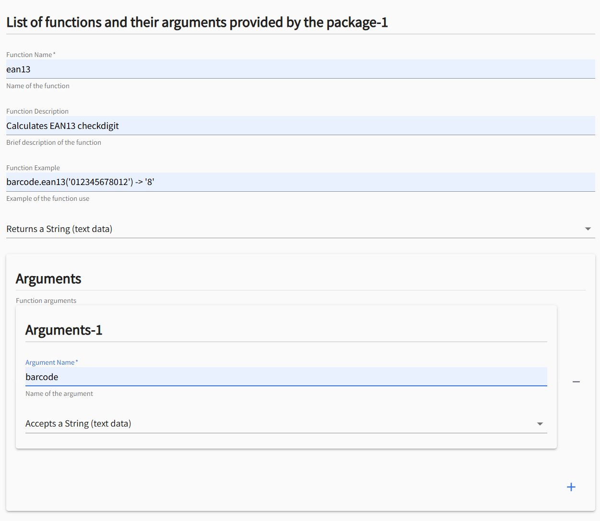
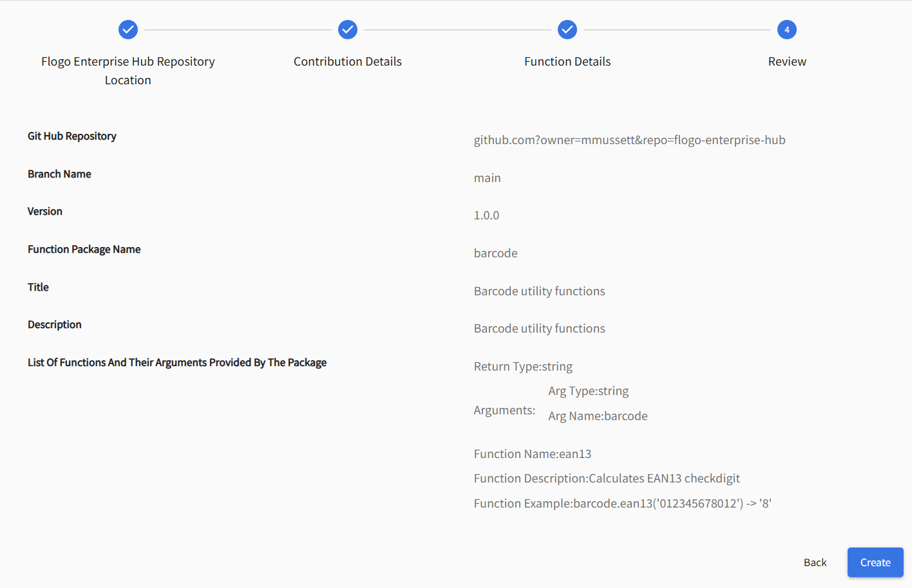
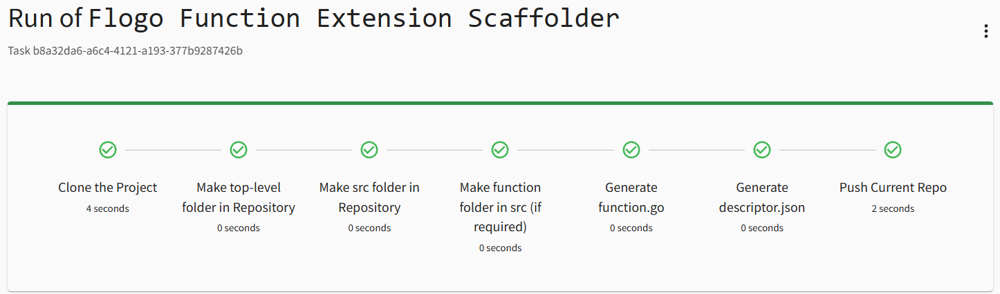

# FLOGO FUNCTION EXTENSION SCAFFOLDER


## About this Template

This template is used to scaffold a Flogo Function Extension. It will populate the necessary structure and files required to implement a Flogo Function component that then can be used by Flogo. 

Navigate to the Develop a new component section under TIBCO Developer Hub. You will see a tile named 'Flogo Function Extension Scaffolder':




## What you’ll need to do first...

### Get yourself a Github Account (if you don't have one)
TIBCO Developer Hub templates uses and store your artefacts in Github. You'll need your own Github Account to be able to utilise the Flogo Trigger Extension Scaffolder.

### Fork the Official TIBCO Flogo Enterprise Repository
Head over to [Flogo Enterprise Github Repository](https://github.com/TIBCOSoftware/flogo-enterprise-hub) and fork it to your Github account. 




Any new extensions you create using the Flogo Extension Generator templates will be placed under the extensions folder in this repository.


## Running the template

### Step 1 - Flogo Enterprise Hub Repository Location



Provide values for Owner, Repository, and Branch. The template will use these values to initiate a pull from this repository.

By default, the Repository name is 'flogo-enterprise-hub'. If you've forked the official [Flogo Enterprise Github Repository](https://github.com/TIBCOSoftware/flogo-enterprise-hub) then leave the default value, else set this to whatever repository name you forked the official repository to.


### Step 2 - Contribution Details




Provide values for Function Package Name, Version, Title, and Description:

| Name | Purpose |
|------|---------|
| **Function Package Name** | is used to group all your extensions together within the IDE. Populates trigger.json |
| **Version** | Version of the extension. |
| **Title** | Name of the extension that your function will take. The template will create a folder under extension using this value. |
| **Description** | Description of the extension. |

### Step 3 - Function Details



The Function Details step allows you to configure one or more functions for your extension.

Provide values for each Function:

| Name | Purpose |
|------|---------|
| Function Name | This is the name of the function. The template will create a folder under extension/<ExtensionName>/src/function using this value. |
| Description of the function | Description of the function |
| Function Result Dropdown | Define an array of one or more setting field name and data types. |
| Arguments Field Definition | Define an array of one or more function argument field name and data types. |


### Step 4 - Review



### Step 5 - Run




# Using the extension

## Pull from Github Repository

Perform a git pull operation to download the extension...

```shell
$ git pull
remote: Enumerating objects: 10, done.
remote: Counting objects: 100% (10/10), done.
remote: Compressing objects: 100% (5/5), done.
remote: Total 8 (delta 1), reused 6 (delta 1), pack-reused 0 (from 0)
Unpacking objects: 100% (8/8), 1.36 KiB | 1.36 MiB/s, done.
From https://github.com/organization/flogo-enterprise-hub
   98258f1..0e415c8  master     -> origin/master
Updating 98258f1..0e415c8
Fast-forward
 extensions/barcode/src/function/descriptor.json | 24 ++++++++++++++++++++++++
 extensions/barcode/src/function/ean13.go        | 56 ++++++++++++++++++++++++++++++++++++++++++++++++++++++++
 2 files changed, 80 insertions(+)
 create mode 100644 extensions/barcode/src/function/descriptor.json
 create mode 100644 extensions/barcode/src/function/ean13.go
 ```

## Open Visual Studio Code

Open Visual Studio Code


# Generated Artefacts

The following artefacts will be generated for your trigger

| Filename | Purpose | 
|----------|---------|
| [descriptor.json](#metadata) | This file is the function descriptor and defines the function metadata and field signature (handler settings & outputs) |
| [<functionName.go>](#logic) | Main function logic goes here |


# The Metadata - descriptor.json

The descriptor.json contains the metadata for your function. The metadata describes to Flogo what the function is called, what the version is, input arguments and return type.

The configurable elements of this file are:

| Name | Purpose |
|------|---------|
| name | The name of the function package |
| title | The title of the function package |
| version |  The version of the activity (it is recommended to use [semantic versioning](https://semver.org/) for your function) |
| type | Must be set to flogo:function. Do not change this. |
| description | Brief description of the function package. |
| functions | An array of function signature objects. Each object defines the name of the function, example, arguments, and return value type. |

# Example

## Metadata <span id="metadata"><span>

```json
{
  "name": "barcode",
  "type": "flogo:function",
  "version": "1.0.0",
  "title": "Barcode utility functions",
  "description": "Barcode utility functions",
  "functions": [
    {
      "name": "ean13",
      "description": "Calculates EAN13 checkdigit",
      "example": "barcode.ean13('012345678012') -> '8'",
      "args": [
        {
          "name": "barcode",
          "type": "string"
        }
      ],
      "return": {
        "type": "string"
      }
    }
  ]
}
```

# The logic - <functionName.go> <span id="logic"><span>


```golang
package barcode

import (
        "fmt"
        "github.com/project-flogo/core/data"
        "github.com/project-flogo/core/data/coerce"
        "github.com/project-flogo/core/data/expression/function"
        "github.com/project-flogo/core/support/log"
)

func init() {
        _ = function.Register(&ean13Func{})
}

type ean13Func struct {
}

// Name returns the name of the function
func (ean13Func) Name() string {
        return "ean13"
}


// GetCategory returns the function category
func (s *ean13Func) GetCategory() string {
        return "barcode"
}

// Sig returns the function signature
func (ean13Func) Sig() (paramTypes []data.Type, isVariadic bool) {

        return []data.Type{data.TypeString}, false
}

// Eval executes the function
func (ean13Func) Eval(params ...interface{}) (interface{}, error) {

        log.RootLogger().Debug("Start of function ean13")

    // Validate parameter count
    if len(params) != 1 {
        return nil, fmt.Errorf("Expected 1 parameters, got %d", len(params))
    }

    // Parameter coercion and validation
    // Coerce parameter 0 (barcode) to string
    _, err := coerce.ToString(params[0])
    if err != nil {
        return nil, fmt.Errorf("Unable to coerce parameter 0 (barcode) to string: %s", err.Error())
    }

    // TODO: Implement your function logic here using the coerced parameters
    // Example implementation - replace with your actual logic
    result := "function result" // Replace with actual implementation
    return result, nil
}
```

### 
