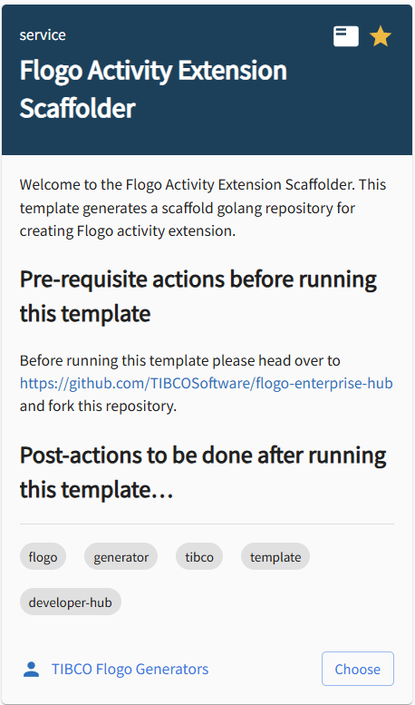
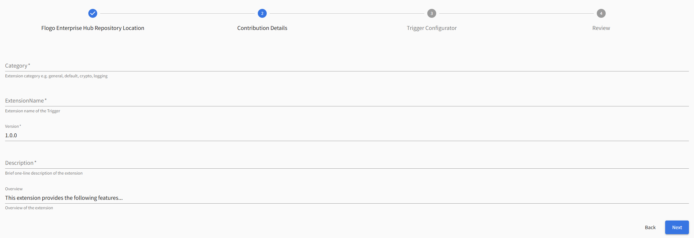
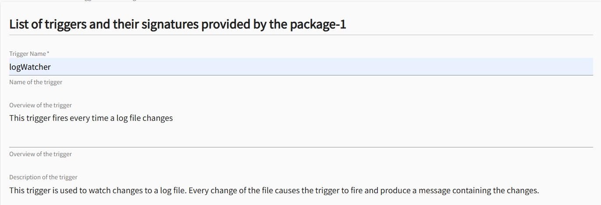
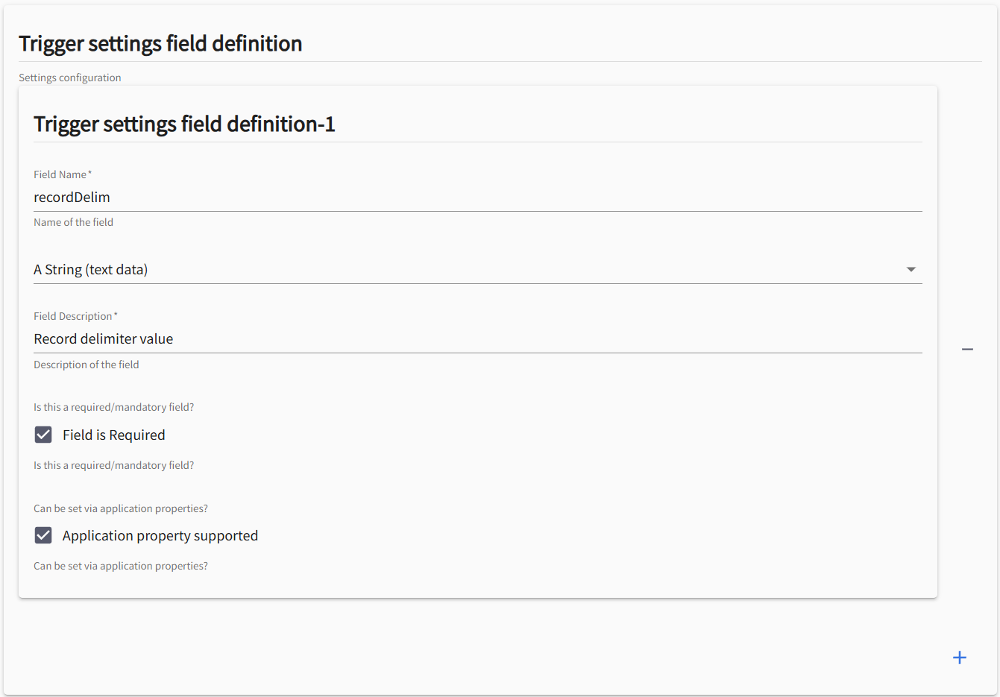
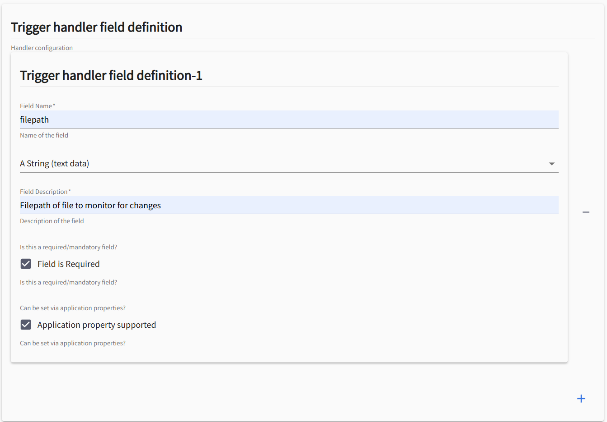
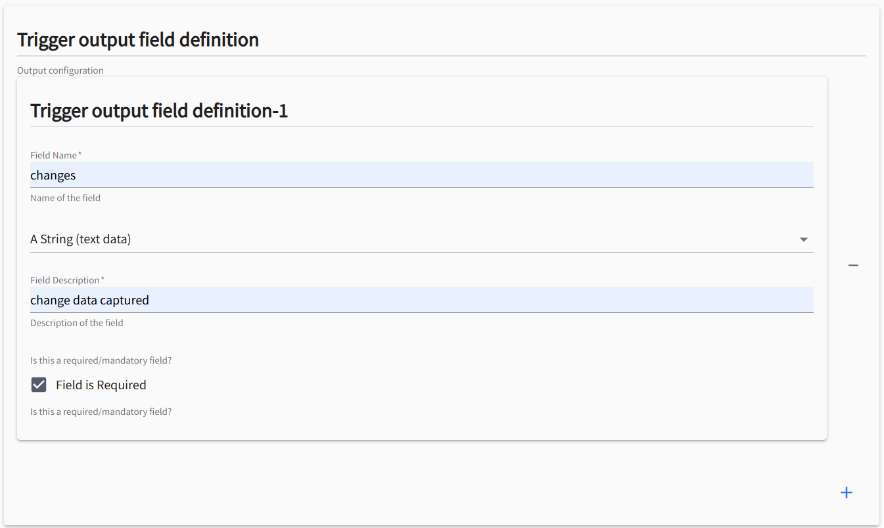
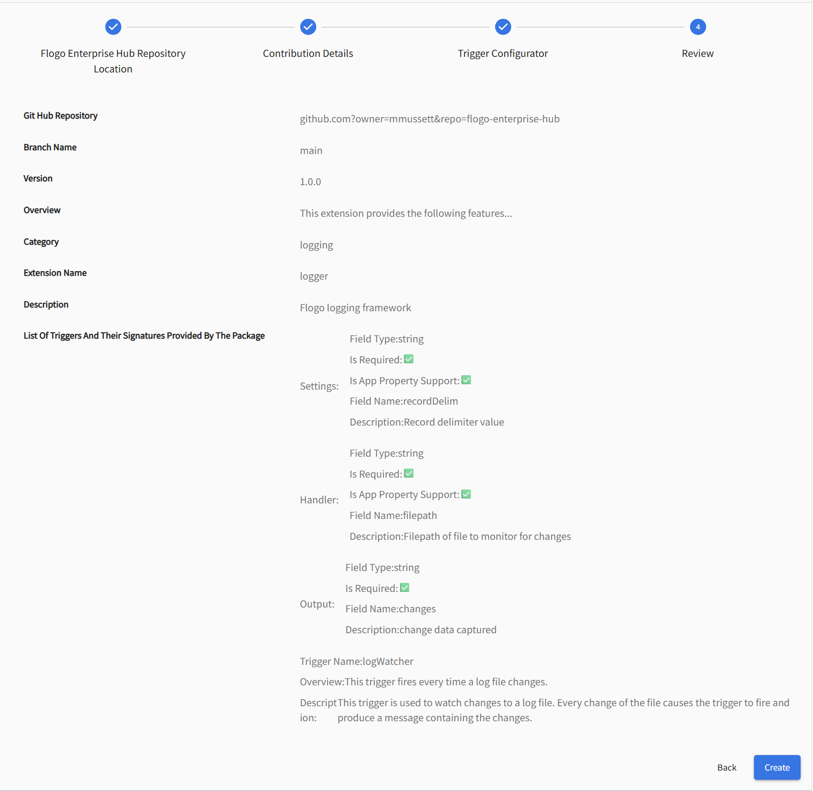
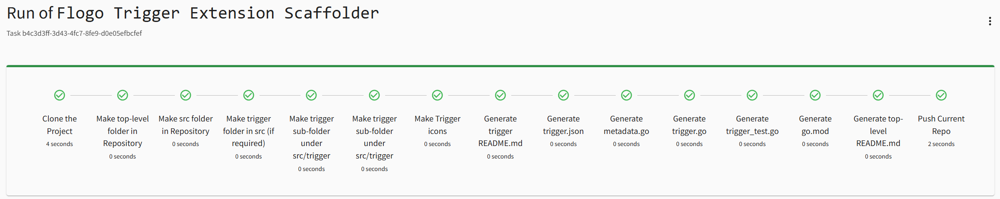

# FLOGO TRIGGER EXTENSION SCAFFOLDER


## About this Template

This template is used to scaffold a Flogo Trigger Extension. It will populate the necessary structure and files required to implement a Flogo Trigger component that then can be used by Flogo. 

Navigate to the Develop a new component section under TIBCO Developer Hub. You will see a tile named 'Flogo Trigger Extension Scaffolder':




## What you’ll need to do first...

### Get yourself a Github Account (if you don't have one)
TIBCO Developer Hub templates uses and store your artefacts in Github. You'll need your own Github Account to be able to utilise the Flogo Trigger Extension Scaffolder.

### Fork the Official TIBCO Flogo Enterprise Repository
Head over to [Flogo Enterprise Github Repository](https://github.com/TIBCOSoftware/flogo-enterprise-hub) and fork it to your Github account. 


Any new extensions you create using the Flogo Extension Generator templates will be placed under the extensions folder in this repository.


## Running the template

### Step 1 - Flogo Enterprise Hub Repository Location


Provide values for Owner, Repository, and Branch. The template will use these values to initiate a pull from this repository.

By default, the Repository name is 'flogo-enterprise-hub'. If you've forked the official [Flogo Enterprise Github Repository](https://github.com/TIBCOSoftware/flogo-enterprise-hub) then leave the default value, else set this to whatever repository name you forked the official repository to.


### Step 2 - Contribution Details




Provide values for Category, ExtensionName, Version, Description, and Overview:

| Name | Purpose |
|------|---------|
| **Category** | is used to group all your extensions together within the IDE. Populates trigger.json |
| **ExtensionName** | Name of the extension that your trigger will take. The template will create a folder under extension using this value. |
| **Version** | Version of the extension. |
| **Description** | Description of the extension. |

### Step 3 - Trigger Configurator

The Trigger Configurator step allows you to configure one or more triggers for your extension.

Provide values for each Trigger configuration:

| Name | Purpose |
|------|---------|
| Trigger Name | This is the name of the trigger. The template will create a folder under extension/<ExtensionName>/src/trigger using this value. |
| Overview of the trigger | Brief overview of the trigger |
| Description of the trigger | Description of the trigger |
| Trigger Settings Field Definition | Define an array of one or more setting field name and data types. |
| Trigger Handler Field Definition | Define an array of one or more handler field name and data types. |
| Trigger Output Field Definition | Define an array of one or more output field name and data types. |


Example: 

| Section | |
|--|--|
| Details |  |
| Settings |  |
| Handler |   |
| Output |   |


### Step 4 - Review



### Step 5 - Run




# Using the extension

## Pull from Github Repository

Perform a git pull operation to download the extension...

```shell
$ git pull
remote: Enumerating objects: 20, done.
remote: Counting objects: 100% (20/20), done.
remote: Compressing objects: 100% (15/15), done.
remote: Total 18 (delta 1), reused 18 (delta 1), pack-reused 0 (from 0)
Unpacking objects: 100% (18/18), 7.76 KiB | 7.76 MiB/s, done.
From https://github.com/organization/flogo-enterprise-hub
   8056230..98258f1  master     -> origin/master
Updating 8056230..98258f1
Fast-forward
 extensions/logger/src/README.md                                    |   8 ++++++++
 extensions/logger/src/go.mod                                       |   3 +++
 extensions/logger/src/trigger/logWatcher/README.md                 |  38 ++++++++++++++++++++++++++++++++++++++
 extensions/logger/src/trigger/logWatcher/icons/trigger-icon.png    | Bin 0 -> 556 bytes
 extensions/logger/src/trigger/logWatcher/icons/trigger-icon@2x.png | Bin 0 -> 1934 bytes
 extensions/logger/src/trigger/logWatcher/icons/trigger-icon@3x.png | Bin 0 -> 2586 bytes
 extensions/logger/src/trigger/logWatcher/metadata.go               |  48 ++++++++++++++++++++++++++++++++++++++++++++++++
 extensions/logger/src/trigger/logWatcher/trigger.go                |  87 +++++++++++++++++++++++++++++++++++++++++++++++++++++++++++++++++++++++++++++++++++++++
 extensions/logger/src/trigger/logWatcher/trigger.json              |  51 +++++++++++++++++++++++++++++++++++++++++++++++++++
 extensions/logger/src/trigger/logWatcher/trigger_test.go           |  13 +++++++++++++
 10 files changed, 248 insertions(+)
 create mode 100644 extensions/logger/src/README.md
 create mode 100644 extensions/logger/src/go.mod
 create mode 100644 extensions/logger/src/trigger/logWatcher/README.md
 create mode 100644 extensions/logger/src/trigger/logWatcher/icons/trigger-icon.png
 create mode 100644 extensions/logger/src/trigger/logWatcher/icons/trigger-icon@2x.png
 create mode 100644 extensions/logger/src/trigger/logWatcher/icons/trigger-icon@3x.png
 create mode 100644 extensions/logger/src/trigger/logWatcher/metadata.go
 create mode 100644 extensions/logger/src/trigger/logWatcher/trigger.go
 create mode 100644 extensions/logger/src/trigger/logWatcher/trigger.json
 create mode 100644 extensions/logger/src/trigger/logWatcher/trigger_test.go
 ```

## Go Mod Tidy

Change directory to extensions/<extensionName>/src folder and run 'go mod tidy'.

```shell
$ go mod tidy
go: finding module for package github.com/project-flogo/core/trigger
go: finding module for package github.com/project-flogo/core/data/metadata
go: finding module for package github.com/project-flogo/core/data/coerce
go: finding module for package github.com/project-flogo/core/support/log
go: found github.com/project-flogo/core/data/coerce in github.com/project-flogo/core v1.6.14
go: found github.com/project-flogo/core/data/metadata in github.com/project-flogo/core v1.6.14
go: found github.com/project-flogo/core/support/log in github.com/project-flogo/core v1.6.14
go: found github.com/project-flogo/core/trigger in github.com/project-flogo/core v1.6.14
```

## Open Visual Studio Code

Open Visual Studio Code


# Generated Artefacts

The following artefacts will be generated for your trigger

| Filename | Purpose | 
|----------|---------|
| [trigger.json](#metadata) | This file is the trigger descriptor and defines the trigger metadata and field signature (handler settings & outputs) |
| [trigger.go](#logic) | Main function logic goes here |
| metadata.go | Structure mapping logic that defines the golang Structs and Functions that coerce data into and out of golang Maps used by Flogo |
| trigger_test.go | Golang tests |
| icons/trigger-icon.png | A 32z32 pixel png used by the trigger |
| icons/trigger-icon@2x.png | A 64x64 pixel png used by the trigger |
| icons/trigger-icon@3x.png | A 96x96 pixel png used by the trigger |


# The Metadata - trigger.json 

The trigger.json contains the metadata for your trigger. The metadata describes to Flogo what the trigger is called, what the version is, it's settings and output structure

The configurable elements of this file are:

| Name | Purpose |
|------|---------|
| title | This appears on the trigger tile within Visual Studio Plugin for Flogo. |
| version |  The version of the activity (it is recommended to use [semantic versioning](https://semver.org/) for your trigger) |
| type | Must be set to flogo:trigger. Do not change this. |
| name | The name of the trigger (this must match the name of the folder of the trigger) |
| author | The author of the trigger, by default it's set to "Created by Flogo Extension Generator", change this to your name |
| settings | An array of name/type pairs that describe global settings of the trigger (configuration that will be the same for every instance of this trigger used in your app) |
| output | An array of name/type pairs that describe the output of the trigger (the data that gets sent to your flow) |
| handler |  An array of name/type pairs that describe flow specific settings of the trigger (configuration that will be unique for every instance of this trigger used in your app) |

# Example

## Metadata <span id="metadata"><span>

```json
{
        "title": "logWatcher Trigger",
        "version": "1.0.0",
        "type": "flogo:trigger",
        "name": "logWatcher",
        "author": "Created by Flogo Extension Generator",
        "display": {
                "description": " trigger",
                "category": "logging",
                "visible": true,
                "smallIcon": "icons/trigger-icon@2x.png",
                "largeIcon": "icons/trigger-icon@3x.png",
                "tags": ["logging"]
        },
        "ref": "github.com/organization/flogo-enterprise-hub/extensions/logger/trigger/",
        "handler": {
                "settings": [
                {
                    "name": "filepath",
                    "type": "string",
                    "required": true,
                    "description": "Filepath of file to monitor for changes",
                    "value":"Default_Value",
                    "display": {
                        "name": "filepath",
                        "description": "Filepath of file to monitor for changes",
                        "required": true,
                        "type":"string",
                        "appPropertySupport": true
                    }
                }
            ]
        },
        "settings": [
        ],
        "outputs": [
        {
           "name": "outputField1",
           "type": "string",
           "required": true
        }
    ]
}
```

## The logic <span id="logic"><span>


```golang
package logWatcher

import (
        "fmt"

        "github.com/project-flogo/core/data/metadata"
        "github.com/project-flogo/core/support/log"
        "github.com/project-flogo/core/trigger"
)

var triggerMd = trigger.NewMetadata(&HandlerSettings{})

func init() {
        _ = trigger.Register(&Trigger{}, &TriggerFactory{})
}

type Trigger struct {
        name   string
        logger log.Logger
}

// Trigger factory
type TriggerFactory struct {
}

// Metadata implements trigger.Trigger.Metadata
func (t *TriggerFactory) Metadata() *trigger.Metadata {
        return triggerMd
}

// New Creates a new trigger instance for a given id
func (t *TriggerFactory) New(config *trigger.Config) (trigger.Trigger, error) {
        s := &Settings{}

        err := metadata.MapToStruct(config.Settings, s, true)
        if err != nil {
                return nil, fmt.Errorf("error occurred in metadata.MapToStruct: [%s]", err.Error())
        }
        return &Trigger{name: config.Name}, nil
}

// Init implements ext.Trigger.Init
func (t *Trigger) Initialize(ctx trigger.InitContext) error {
        t.logger = ctx.Logger()

        t.logger.Debugf("Initializing %s", t.name)

        for _, handler := range ctx.GetHandlers() {

                handlerSettings := &HandlerSettings{}

                err := metadata.MapToStruct(handler.Settings(), handlerSettings, true)

                if err != nil {
                        return fmt.Errorf("error - %s", err.Error())
                }

        }
        return nil
}

func (t *Trigger) Start() error {

        // Start the trigger
        t.logger.Infof("Starting %s...", t.name)


        return nil
}

// Stop implements ext.Trigger.Stop
func (t *Trigger) Stop() error {

        t.logger.Debugf("Stopping %s", t.name)

        return nil
}

//commenting pause resume since its not implemented completely for FlowLimit
// func (t *Trigger) Pause() error {
//      return nil
// }

// func (t *Trigger) Resume() error {
//      return nil
// }
```

### 
