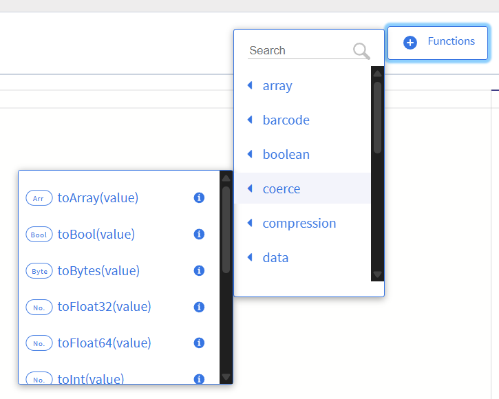

# HOW TO WRITE A FLOGO FUNCTION EXTENSION



To write a Flogo extension - whether it's an activity, trigger, or function - you'll be working in Go and following a specific structure that Flogo expects. Here's a practical breakdown tailored for somebody like you, who's already deep into backend and infrastructure tooling.

## Prerequisites

* [Go](https://go.dev/doc/install) installed (Flogo is written on Go, hence the 'go' reference in 'Flogo')
* [Visual Studio Code](https://code.visualstudio.com/Download) installed.
* [TIBCO Flogo Enterprise](https://docs.tibco.com/products/tibco-flogo-enterprise-latest) downloaded and TIBCO Flogo Extension for Visual Studio Code installed. 

## Architecture

* Flogo groups function together depending on the responsibility.
* The functional grouping is typically also the golang package name. 
* The package name provide by you is completely arbitary but should be in lowerCamelCase. 
* A Flogo Function extension can compromise of one or more functions. 
* Each function is provided in it's own source file under your function package folder.
* A single descriptor.json file is required and contains an array of all the functions declared under your functional package.


### Supported data types and their mapping
Flogo supports inline functions that are evaluated and executed by the Flogo Engine at runtime. The function can be added to any input argument on any activity such as a Mapper. Unlike Flogo Activities, Flogo Functions support multiple arguments as input and return exactly one result.

The following primative data types are supported by Flogo:

#### Standard Data Types:
|Name|Go Type |Description|
|--- |--- |--- |
| any     | interface{} |  Can be any value |
| string  | string      | A string|
| int     | int   | Integer, the size is system dependent |
| int32   | int32 | 32 bit integer |
| int64   | int64 | 64 bit integer |
| float32 | float32 | 32 bit float |
| float64 | float64 | 64 bit float |
| bool    | bool    | Boolean |
| bytes   | []byte  | Byte array |
| array   | []interface{} | Array of "any value" |
| object  | map[string]interface{} | Object - typically translated JSON object |
| params  | map[string]string      | Parameter map with string keys and values |
| map     | map[interface{}]interface{} | A map with any type of key or value |


### Naming guidelines

Stick to the following rules when naming Flogo functions:

| Rule | Description | Examples |
|------|-------------|---------|
| LowerCamelcase Only | Use lowerCamelCase. No underscores | checkdigit &check; <br> checkDigit &check; <br> Check_Digit &cross; <br> check_digit &cross; |  
| Short & meaningful | Prefer concise nouns: crypto, checkdigit, json etc | crypto &check; <bR> cryptographicmessagedigest &cross; |
| Avoid stuttering | Don't repeat the use of 'package' or responsibility name' | jsonpath &check; <br> jsonpackage &cross; |
| No generic names | Avoid vague names | utils &cross; <br> common &cross; <br> helpers &cross; |
| Organise by responsibility | Group implementation code by what it does-not by type | jsonpath &check; <br> json &cross; |


### Flogo function extension folder structure

Flogo functions follow a simple structure of:

* Flogo Function extensions should reside under `extensions/functions` folder in a package folder `<functionPackageDir>` E.g. checkdigit. 
* The `<functionPackageDir>` must match the golang package name.

 
It is highly recommended that you follow the [naming guidelines](#naming-guidelines)


```
extensions 
    ¦
    +--- functions
            ¦
            +--- <functionPackageDir>
            ¦       ¦
            ¦       +--- <function>.go
            ¦       +--- <anotherFunction>.go
            ¦       +--- descriptor.json
            ¦       +--- go.mod
            ¦       +--- go.sum
            ¦
            +--- checkdigit
                    +--- ean8.go
                    +--- ean13.go
                    +--- luhn.go
                    +--- descriptor.json
                    +--- go.mod
                    +--- go.sum
```

### Structure of Flogo function extension golang implementation

A Flogo function comprises of the following:

| File | Description |
|------|-------------|
| [`<function>.go`](#functiongo) | Actual function implemtation logic.<br> Your package can have one or more implementations |
| [descriptor.json](#descriptorjson) | Function metafile |
| go.mod <br> go.sum | Golang module files |


#### descriptor.json

The descriptor.json is a metafile that describes your Flogo function and is required for all function implementations.


It comprises of the following JSON fields:

* *name* must match the golang package name
* *type* must be **flogo:function**
* *title* and *description* currently not used - free form for you to populate
* *functions* is an array of function signature(s) comprising of:
    * *name* is the name of the function
    * *description* description appears in the hover-over 
    * *example*
    * *args* is an array of objects of name-type pairs
    * *return* is an object containing the return data *type* 

##### Contrived `descriptor.json` example:
```json
{
  "name": "maths",
  "type": "flogo:function",
  "version": "1.0.0",
  "title": "mathsFunctions",
  "description": "mathsFunctions",
  "functions": [
    {
      "name": "addNumbers",
      "description": "Adds numbers",
      "example": "mathsFunctions.addNumbers(1,2) => 3",
      "args": [
        {
          "name": "number1",
          "type": "int32"
        },
        {
          "name": "number2",
          "type": "int32"
        }
      ],
      "return": {
        "type": "int64"
      }
    }
  ]
}
```

##### descriptor.json Schema
```json
{
  "$schema": "http://json-schema.org/draft-04/schema#",
  "type": "object",
  "properties": {
    "name": {
      "type": "string"
    },
    "type": {
      "type": "string"
    },
    "version": {
      "type": "string"
    },
    "title": {
      "type": "string"
    },
    "description": {
      "type": "string"
    },
    "functions": {
      "type": "array",
      "items": [
        {
          "type": "object",
          "properties": {
            "name": {
              "type": "string"
            },
            "description": {
              "type": "string"
            },
            "example": {
              "type": "string"
            },
            "args": {
              "type": "array",
              "items": [
                {
                  "type": "object",
                  "properties": {
                    "name": {
                      "type": "string"
                    },
                    "type": {
                      "type": "string"
                    }
                  },
                  "required": [
                    "name",
                    "type"
                  ]
                }
              ]
            },
            "return": {
              "type": "object",
              "properties": {
                "type": {
                  "type": "string"
                }
              },
              "required": [
                "type"
              ]
            }
          },
          "required": [
            "name",
            "description",
            "example",
            "args",
            "return"
          ]
        }
      ]
    }
  },
  "required": [
    "name",
    "type",
    "version",
    "title",
    "description",
    "functions"
  ]
}
```

#### `<function>.go`

The `<function>.go` file contains the actual code of your function. <br>
See [Naming guidelines](#naming-guidelines) on good practice for its name. <br>
For each function defined in functions array object within the [descriptor.json](#descriptorjson) file you will need its own `<function>`.go file.

It must implement the following interface:

```golang
type Function interface {
	Name() string
	Sig() (paramTypes []data.Type, isVariadic bool)
	Eval(params ...interface{}) (interface{}, error)
}
```


* *Name()* returns the name of the function, the return string **must** match the value of *name* in *descriptor.json*
* *Sig()* returns the function signature of the function as slice of data.Type. This **must** match the *args* data types defined in *descriptor.json*. See [Standard Data Types](#standard-data-types) for all available data types supported.
* *Eval()* takes a variable number of params as interface{} as arguments and returns a result as interface{}.

As well as the above methods, one piece of further logic is requred that is used to register the function with the Flogo runtime. It comprises of a struct{} and method init():

```golang
type FuncStruct struct {
}

func init() {
    function.Register(&FuncStruct{})
}
```

##### Contrived `<function>.go` example:

```golang
package maths

import (
	"fmt"

	"github.com/project-flogo/core/data"
	"github.com/project-flogo/core/data/coerce"
	"github.com/project-flogo/core/data/expression/function"
	"github.com/project-flogo/core/support/log"
)

type addNumbersFunc struct {
}

func init() {
	function.Register(&addNumbersFunc{})
}

// Name returns the name of the function
func (s *addNumbersFunc) Name() string {
	return "addNumbers"
}

// Sig returns the function signature
func (s *addNumbersFunc) Sig() (paramTypes []data.Type, isVariadic bool) {

	return []data.Type{data.TypeInt, data.TypeInt}, false
}

// Eval executes the function
func (s *addNumbersFunc) Eval(params ...interface{}) (interface{}, error) {

	log.RootLogger().Debug("Start of function addNumbers")

	// Validate parameter count
	if len(params) != 2 {
		return nil, fmt.Errorf("expected 2 parameters, got %d", len(params))
	}

	// Parameter coercion and validation
	// Coerce parameter 0 (number1) to int
	number1, err := coerce.ToInt64(params[0])
	if err != nil {
		return nil, fmt.Errorf("unable to coerce parameter 0 (number1) to int: %s", err.Error())
	}
	// Coerce parameter 1 (number2) to int
	number2, err := coerce.ToInt64(params[1])
	if err != nil {
		return nil, fmt.Errorf("unable to coerce parameter 1 (number2) to int: %s", err.Error())
	}


	result := number1 + number2 
	return result, nil
}

```

#### `go.mod`  

To generate the golang module files you will need to issue a `go mod init` within your `<functionPackageDir>`

Contrived example:

```bash
$ mkdir maths && cd maths
$ go mod init github.com/organization/flogo-enterprise-hub/extensions/functions/maths
go: creating new go.mod: module github.com/organization/flogo-enterprise-hub/extensions/functions/maths
```

#### `go.sum`

Once you have written your `<function>.go` you will need to generate the `go.sum` using a `go mod tidy` command.

Contrived example:

```bash
go mod tidy
go: finding module for package github.com/project-flogo/core/support/log
go: finding module for package github.com/project-flogo/core/data/coerce
go: finding module for package github.com/project-flogo/core/data
go: finding module for package github.com/project-flogo/core/data/expression/function
go: found github.com/project-flogo/core/data in github.com/project-flogo/core v1.6.14
go: found github.com/project-flogo/core/data/coerce in github.com/project-flogo/core v1.6.14
go: found github.com/project-flogo/core/data/expression/function in github.com/project-flogo/core v1.6.14
go: found github.com/project-flogo/core/support/log in github.com/project-flogo/core v1.6.14
```


## Step-by-Step: Flogo Function Extension from start-to-finish

### 1. Create a fork of the official [flogo-enterprise-hub](https://github.com/TIBCOSoftware/flogo-enterprise-hub/fork) repository

### 2. Clone the forked repository

```bash
gh repo clone TIBCOSoftware/flogo-enterprise-hub
```

### 3. Create your extension directory structure 

```bash
mkdir -p flogo-enterprise-hub/extensions/functions/<functionPackageName> && cd flogo-enterprise-hub/extensions/functions/<functionPackageName>
```

### 4. Generate `go.mod`
```bash
go mod init github.com/organization/flogo-enterprise-hub/extensions/functions/<functionPackageName>
```

### 5. Create `descriptor.json`

Use the [example](#contrived-descriptorjson-example) to quickly get you started. Modify for your use-case. <br> 
Don't forget to modify the *name* field to match your chosen `<functionPackageName>`

### 6. Create `<function>.go`

Use the [example](#contrived-functiongo-example) to quickly get you started. Modify for your use-case.
Don't forget to modify the *package name* to match your chosen `<functionPackageName>`

### 7. Generate `go.sum`
```bash
go mod tidy
```

### 8. Create `<function>_test.go`

### 


