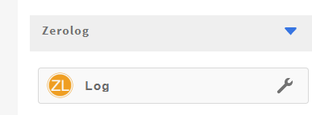
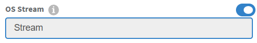
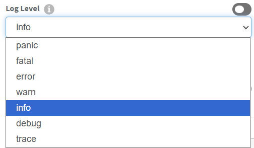
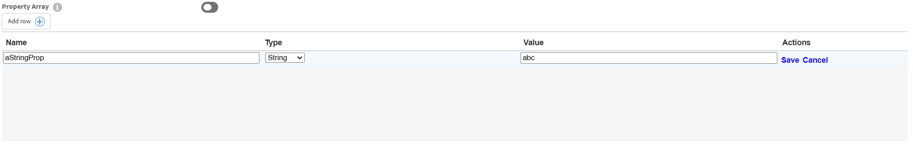
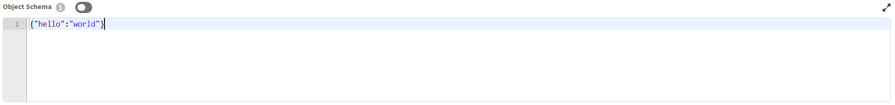

# HOW TO WRITE A FLOGO TRIGGER EXTENSION



To write a Flogo extension - whether it's an activity, trigger, or function - you'll be working in Go and following a specific structure that Flogo expects. Here's a practical breakdown tailored for somebody like you, who's already deep into backend and infrastructure tooling.
ya
## Prerequisites

- [Go](https://go.dev/doc/install) installed (Flogo is written on Go, hence the 'go' reference in 'Flogo')
- [Visual Studio Code](https://code.visualstudio.com/Download) installed.
- [TIBCO Flogo Enterprise](https://docs.tibco.com/products/tibco-flogo-enterprise-latest) downloaded and TIBCO Flogo Extension for Visual Studio Code installed.

## Architecture

- Flogo triggers have a single duty of responsibilty.
- One or more trigger can exists for each extension.
- Each trigger has its own golang package name.
- Each trigger has its own json metafile [`trigger.json`](#descriptorjson)
- Each trigger has its own golang source files [`trigger.go`](#triggergo) and [`metadata.go`](#metadatago)
- The package name provide by you is completely arbitary but should be in lowerCamelCase.

### Supported data types and their mapping

The following primative data types are supported by Flogo:

#### Standard Data Types:

| Name    | Go Type                     | Description                               |
| ------- | --------------------------- | ----------------------------------------- |
| any     | interface{}                 | Can be any value                          |
| string  | string                      | A string                                  |
| int     | int                         | Integer, the size is system dependent     |
| int32   | int32                       | 32 bit integer                            |
| int64   | int64                       | 64 bit integer                            |
| float32 | float32                     | 32 bit float                              |
| float64 | float64                     | 64 bit float                              |
| bool    | bool                        | Boolean                                   |
| bytes   | []byte                      | Byte array                                |
| array   | []interface{}               | Array of "any value"                      |
| object  | map[string]interface{}      | Object - typically translated JSON object |
| params  | map[string]string           | Parameter map with string keys and values |
| map     | map[interface{}]interface{} | A map with any type of key or value       |

### Naming guidelines

Stick to the following rules when naming Flogo functions:

| Rule                       | Description                                               | Examples                                                                                     |
| -------------------------- | --------------------------------------------------------- | -------------------------------------------------------------------------------------------- |
| LowerCamelcase Only        | Use lowerCamelCase. No underscores                        | checkdigit &check; <br> checkDigit &check; <br> Check_Digit &cross; <br> check_digit &cross; |
| Short & meaningful         | Prefer concise nouns: crypto, checkdigit, json etc        | crypto &check; <bR> cryptographicmessagedigest &cross;                                       |
| Avoid stuttering           | Don't repeat the use of 'package' or responsibility name' | jsonpath &check; <br> jsonpackage &cross;                                                    |
| No generic names           | Avoid vague names                                         | utils &cross; <br> common &cross; <br> helpers &cross;                                       |
| Organise by responsibility | Group implementation code by what it does-not by type     | jsonpath &check; <br> json &cross;                                                           |

### Flogo trigger extension folder structure

Flogo trigger follow a simple structure of:

- Flogo Trigger extensions should reside under `extensions/<extensionNameDir>` E.g. tcp.
- The `<triggerPackageDir>` must match the golang package name.

It is highly recommended that you follow the [naming guidelines](#naming-guidelines)

```
extensions
    ¦
    +--- <extensionNameDir>
            ¦
            +--- src
            ¦     ¦
            ¦     +--- trigger
            ¦     ¦      ¦
            ¦     ¦      +--- <triggerPackageDir>
            ¦     ¦              ¦
            ¦     ¦              +--- trigger.json
            ¦     ¦              +--- trigger.go
            ¦     ¦              +--- metadata.go
            ¦     ¦              +--- go.mod
            ¦     ¦              +--- go.sum
            ¦     ¦              +--- icons
            ¦     ¦                     ¦
            ¦     ¦                     +--- <triggerName>-icon.png
            ¦     ¦                     +--- <triggerName>-icon@2x.png
            ¦     ¦                     +--- <triggerName>-icon@3x.png
            ¦     ¦
            |     ¦
            ¦     +-- activity
            ¦            ¦
            ¦            +--- <activityPackageDir>
            ¦                    ¦
            ¦                    +--- activity.json
            ¦                    +--- activity.go
            ¦                    +--- metadata.go
            ¦                    +--- go.mod
            ¦                    +--- go.sum
            ¦                    +--- icons
            ¦                           ¦
            ¦                           +--- <activityName>-icon.png
            ¦                           +--- <activityName>-icon@2x.png
            ¦                           +--- <activityName>-icon@3x.png
            ¦
            +--- samples
            ¦
            +--- docs
```

### Structure of Flogo trigger extension golang implementation

A Flogo trigger comprises of the following:

| File                               | Description                                                                             |
| ---------------------------------- | --------------------------------------------------------------------------------------- |
| [trigger.go](#triggergo)           | Trigger implemtation logic.<br> Your package has one implementations                    |
| [metadata.go](#metadatago)         | Input and Output structure and mapping logic                                            |
| [descriptor.json](#descriptorjson) | Trigger metafile defines Trigger attributes, its Settings, Handler Settings, and Output |
| go.mod <br> go.sum                 | Golang module files                                                                     |

#### descriptor.json

The descriptor.json is a metafile that describes your Flogo trigger and is required for each trigger implementations.

It comprises of the following JSON fields:

| JSON Path              | Description                                                                                                    |
| ---------------------- | -------------------------------------------------------------------------------------------------------------- |
| .name                  | The name of the Activity <br> This must match with the name of the folder in which the Activity has been added |
| .type                  | The type of the extension. Must be \*flogo:action\*\*                                                          |
| .title                 | The activity tile. Appears on activity tile.                                                                   |
| .author                | not used - freeform field, used to record the creator of the extension.                                        |
| .display.category      | is used to group activities together in the UI's activity pull-out bar.                                        |
| .display.visible       | shows or hides activity in UI. _Set it true_.                                                                  |
| .display.description   | shown on the activity tile under title.                                                                        |
| .display.smallIcon     | filename of 64x64 pixel png image file located under `icons` folder.                                           |
| .display.largeIcon     | filename of 96x96 pixel png image file located under `icons` folder. Shown on the Activity tile on the convas. |
| .ref                   | points to the repository location for the activity                                                             |
| .feature.retry.enabled | Enables the retry-on-error feature                                                                             |
| .settings              | An array of name-type pairs that describe the Activity settings.                                               |
| .handler.settings      | An array of name-type pairs that describe the input to the Activity.                                           |
| .output                | An array of name-type pairs that describe the output of the Activity.                                          |

See [UI decorators options](#ui-decorator-options) on the various supported UI widgets available for Settings, Inputs, and Outputs.

<br>
#### Contrived `descriptor.json` example:

```json
{
  "title": "TCP Server Trigger",
  "version": "1.0.0",
  "type": "flogo:trigger",
  "name": "TCP Server",
  "author": "Created by Flogo Extension Generator",
  "display": {
    "description": " trigger",
    "category": "TCP",
    "visible": true,
    "smallIcon": "icons/trigger-icon@2x.png",
    "largeIcon": "icons/trigger-icon@3x.png",
    "tags": ["TCP"]
  },
  "ref": "github.com/organization/flogo-enterprise-hub/extensions/tcp/src/trigger/tcpServer",
  "handler": {
    "settings": []
  },
  "settings": [
    {
      "name": "address",
      "type": "string",
      "required": true,
      "display": {
        "name": "address",
        "description": "Network Address to establish listener on",
        "required": true,
        "type": "string",
        "appPropertySupport": true
      }
    },
    {
      "name": "port",
      "type": "int",
      "required": true,
      "display": {
        "name": "port",
        "description": "Port on network address to establish listener on",
        "required": true,
        "type": "int",
        "appPropertySupport": true
      }
    }
  ],
  "outputs": [
    {
      "name": "data",
      "type": "object",
      "required": true,
      "display": {
        "name": "JSON Schema",
        "description": "An example JSON-based object",
        "type": "texteditor",
        "syntax": "json",
        "mappable": true,
        "visible": true
      }
    }
  ]
}
```

#### trigger.go

The `trigger.go` file contains the actual code of your activity. <br>
See [Naming guidelines](#naming-guidelines) on good practice for its name. <br>

A working example can be found [here](https://github.com/project-flogo/core/blob/master/examples/trigger/trigger.go)

It must implement the following interfaces:

```golang
type Trigger interface {

	// Initialize is called to initialize the Trigger
	Initialize(ctx InitContext) error
}

// Managed is an interface that is implemented by an object that needs to be
// managed via start/stop
type Managed interface {

	// Start starts the managed object
	Start() error

	// Stop stops the manged object
	Stop() error
}

// Factory is used to create new instances of a trigger
type Factory interface {

	// Metadata returns the metadata of the trigger
	Metadata() *Metadata

	// New create a new Trigger
	New(config *Config) (Trigger, error)
}
```

- _Metadata()_ returns the activities metadata
- _Eval()_ Eval is called when an Activity is being evaluated. Returning true indicates that the task is done.

As well as the above methods, one piece of further logic is requred that is used to register the activity with the Flogo runtime. It comprises of a struct{} and method init():

```golang
type Activity struct {
}

func init() {
    function.Register(&Activity{})
}
```

##### Settings handler logic

Settings values are passed into your activity via the activity.InitContext and are accessible in `func New()` factory function.<br>
The `func New()` acts as a factory method and can be used to further initialise any state.<br>
You should implement `func New()` if you require any setup logic to be execute only once during startup of the Flogo engine.

```golang
func New(ctx activity.InitContext) (activity.Activity, error) {

    // Create a struct instance s for our settings
    s := &Settings{}

    // Maps values into our settings structure
    err := metadata.MapToStruct(ctx.Settings(), s, true)
    if err != nil {
        return nil, err
    }

    // We can reference our structure instance members
    ctx.Logger().Infof("Setting - Stream: %s, Level: %s", s.Stream, s.Level)

    // Create a structure instance act for our activity
    act := &Activity{}

    // Use our setting s.Level value to set the correct OS Stream to log to...
    if s.Level == "stdout" {
        act.logger = zerolog.New(os.Stdout).With().Timestamp().Logger()
    } else {
        act.logger = zerolog.New(os.Stderr).With().Timestamp().Logger()
    }

    // Set the activity level field so we can use it in our Eval() func in order to log at the correct level.
    act.level = s.Level
    return act, nil
}
```

#### metadata.go

The `metadata.go` defines input and output structures and implements necessary logic to map values into and out of these structures. Both Input handler and Output handler logic is implemented within `metadata.go`

##### Input handler logic

Any input values defined in `descriptor.json` should also be defined in your `type Input struct{}`<br>
For example we wish our activity to have a single input field `inString`, in your `descriptor.json`:

```json
  "inputs": [
    {
      "name": "inString",
      "type": "string",
      "description": "Input string",
      "required": true
    }
  ]
```

In `metadata.go` define your `type Input struct{}` to be:

```golang
type Input struct {
    InString string `md:"inString"`
}
```

Then, implement your handler code (noting the pointer receiver is for your defined Input struct):

```golang
func (i *Input) ToMap() map[string]interface{} {
    return map[string]interface{}{
        // map key must exactly match field in descriptor and structure
        "inString": i.InString,
    }
}

func (i *Input) FromMap(values map[string]interface{}) error {
    var err error
    i.InString, err = coerce.ToString(values["inString"])
    if err != nil {
        return err
    }
    return nil
}
```

Internally Flogo uses `map[string]interface{}` to store your input data and you must implement two functions:

- `func (*Input) ToMap() map[string]interface{} {}`
- `func (*Input) FromMap(values map[string]interface{}) error {}`

* FromMap() is used to move data from a `map[string]interface{}` to your `type Input struct{}`
* ToMap() is used to move data from `type Input struct{}` to a `map[string]interface{}`

The Flogo runtime automatically calls `FromMap()` and `ToMap()` for you.

##### Output handler logic

Flogo uses the same mechanism for output as input.<br>
Any output values defined in `descriptor.json` should also be defined in your `type Output struct{}`<br>
For example, if you have the following `outString` field as output in your `descriptor.json`:

```json
  "output": [
    {
      "name": "outString",
      "type": "string",
      "description": "Output string",
    }
  ]
```

You will define your `type Output struct{}` to be:

```golang
type Output struct {
    OutString string `md:"outString"`
}
```

Then, implement your handler code (noting the pointer receiver is for Output struct):

```golang
func (o *Output) ToMap() map[string]interface{} {
    return map[string]interface{}{
        "outString": o.OutString,
    }
}

func (o *Output) FromMap(values map[string]interface{}) error {
    var err error
    o.OutString, err = coerce.ToString(values["outString"])
    if err != nil {
        return err
    }
    return nil
}
```

Internally Flogo uses `map[string]interface{}` to store your output data and you must implement two functions to move data in to and out of the map:

- `func (*Output) ToMap() map[string]interface{} {}`
- `func (*Output) FromMap(values map[string]interface{}) error {}`

* FromMap() is used to move data from a `map[string]interface{}` to your `type Input struct{}` member fields.
* ToMap() is used to move data from `type Input struct{}` member fields to a `map[string]interface{}`

The Flogo runtime automatically calls `FromMap()` and `ToMap()` for you.

When writing your FromMap() function the following data coerce methods are available to you:

| Flogo Type | Go Type                | Method              |
| ---------- | ---------------------- | ------------------- |
| any        | interface{}            | coerce.ToAny()      |
| string     | string                 | coerce.ToString()   |
| int        | int                    | coerce.ToInt()      |
| int32      | int32                  | coerce.ToInt32()    |
| int64      | int64                  | coerce.ToInt64()    |
| float32    | float32                | coerce.ToFloat32()  |
| float64    | float64                | coerce.ToFloat64()  |
| boolean    | bool                   | coerce.ToBool()     |
| bytes      | []byte                 | coerce.ToBytes()    |
| dateTime   | time                   | coerce.ToDateTime() |
| array      | []interface{}          | coerce.ToArray()    |
| object     | map[string]interface{} | coerce.ToObject()   |
| params     | map[string]string      | coerce.ToParams()   |

<br>
Example, if my `type struct{}` contained a member field such: <br>

```golang
type Input struct {
    Message map[] ``md:"message"``
}
```

In the ToMap() function you would write:

```golang
func (i *Input) ToMap() map[string]interface{} {

    return map[string]interface{}{
        "message": i.Message,
    }
}
```

In the FromMap function you would write:

```golang
func (i *Input) FromMap(values map[string]interface{}) error {

    var err error
    // Using coersion take the map key "message" value and populate the Message field member of the Input struct
    i.Message, err = coerce.ToString(values["message"])
    if err != nil {
        return err
    }

    return nil
}
```

#### Contrived `metadata.go` example:

```golang
package log

import (
    "github.com/project-flogo/core/data/coerce"
)

type Input struct {
    Message string `md:"message"`
}

func (i *Input) ToMap() map[string]interface{} {

    return map[string]interface{}{
        "message": i.Message,
    }
}

func (i *Input) FromMap(values map[string]interface{}) error {

    var err error
    i.Message, err = coerce.ToString(values["message"])
    if err != nil {
        return err
    }

    return nil
}

type Output struct {
    Message string `md:"message"`
}

func (o *Output) FromMap(values map[string]interface{}) error {
    message, _ := coerce.ToString(values["message"])
    o.Message = message
    return nil
}

func (o *Output) ToMap() map[string]interface{} {
    return map[string]interface{}{
        "message": o.Message,
    }
}
```

#### Activity Eval Handler logic

The `func (*Activity) Eval(activity.Context) (bool, error)` is called when an Activity is being evaluated. Returning true indicates that the task is done.

##### Marshalling Input structure

If your Activity has any Input data requirements then you will need to implement marshalling logic in order to populate your `type Input struct{}` as defined in `metadata.go`

```golang
    input := &Input{}
    err = ctx.GetInputObject(input)
    if err != nil {
        return false, err
    }
```

##### Accessing Activity structure members

Access to Activity struct members can be achieved using the `*Activity` pointer reference.

```golang
    switch a.level {
    case "panic":
        a.logger.Panic().Msg(input.Message)
    case "fatal":
        a.logger.Fatal().Msg(input.Message)
    case "error":
        a.logger.Error().Msg(input.Message)
    case "warn":
        a.logger.Warn().Msg(input.Message)
    case "info":
        a.logger.Info().Msg(input.Message)
    case "debug":
        a.logger.Debug().Msg(input.Message)
    case "trace":
        a.logger.Trace().Msg(input.Message)
    default:
        a.logger.Info().Msg(input.Message)
    }
```

##### Logging

The `activity.Context` provides an instantiated Logger:

```golang
    ctx.Logger().Infof("Message: %s", input.Message)
```

##### Marshalling Output structure

If your Activity has any Output data requirements then you will need to implement marshalling logic in order to populate your `type Output struct{}` as defined in `metadata.go`

```golang
    output := &Output{Message: input.Message}
    err = ctx.SetOutputObject(output)
    if err != nil {
        return true, err
    }
```

#### Contrived `activity.go` example:

```golang
package log

import (
    "os"

    "github.com/project-flogo/core/activity"
    "github.com/project-flogo/core/data/metadata"
    "github.com/rs/zerolog"
)

type Activity struct {
    logger zerolog.Logger
    level  string
}

var activityMd = activity.ToMetadata(&Settings{}, &Input{}, &Output{})

// Metadata returns the activity's metadata
func (a *Activity) Metadata() *activity.Metadata {
    return activityMd
}

func init() {
    activity.Register(&Activity{}, New)
}

func New(ctx activity.InitContext) (activity.Activity, error) {

    s := &Settings{}
    err := metadata.MapToStruct(ctx.Settings(), s, true)
    if err != nil {
        return nil, err
    }

    ctx.Logger().Infof("Setting - Stream: %s, Level: %s", s.Stream, s.Level)

    act := &Activity{}

    if s.Level == "stdout" {
        act.logger = zerolog.New(os.Stdout).With().Timestamp().Logger()
    } else {
        act.logger = zerolog.New(os.Stderr).With().Timestamp().Logger()
    }

    act.level = s.Level
    return act, nil
}

func (a *Activity) Eval(ctx activity.Context) (done bool, err error) {

    input := &Input{}
    err = ctx.GetInputObject(input)
    if err != nil {
        return false, err
    }

    switch a.level {
    case "panic":
        a.logger.Panic().Msg(input.Message)
    case "fatal":
        a.logger.Fatal().Msg(input.Message)
    case "error":
        a.logger.Error().Msg(input.Message)
    case "warn":
        a.logger.Warn().Msg(input.Message)
    case "info":
        a.logger.Info().Msg(input.Message)
    case "debug":
        a.logger.Debug().Msg(input.Message)
    case "trace":
        a.logger.Trace().Msg(input.Message)
    default:
        a.logger.Info().Msg(input.Message)
    }

    ctx.Logger().Infof("Message: %s", input.Message)

    // Copy input message to output message
    output := &Output{Message: input.Message}
    err = ctx.SetOutputObject(output)
    if err != nil {
        return true, err
    }

    return true, nil
}
```

## UI decorator options

Settings, Input, and Output fields support various decorator UI options:

1. Simple text input box for name-type pair:



```json
{
  "name": "someSettingValue",
  "type": "string",
  "display": {
    "name": "Some Setting Value",
    "description": "Enter a string value",
    "appPropertySupport": true
  },
  "value": "default string value"
}
```

2. Simple boolean toggle:


```json
{
  "name": "includeTimestamp",
  "type": "bool",
  "required": true,
  "valaue": true,
  "display": {
    "name": "Include timestamp in structure",
    "description": "If set to true, structured log will contain timestamp",
    "type": "boolean"
  }
}
```

3. Dropdown box:



```json
{
  "name": "stream",
  "type": "string",
  "required": true,
  "display": {
    "name": "OS Stream",
    "description": "Select one stream from the dropdown",
    "type": "dropdown",
    "selection": "single",
    "appPropertySupport": true
  },
  "allowed": ["stdout", "stderr"],
  "value": "stdout"
}
```

4. Array table:



```json
{
  "name": "PropertyArray",
  "type": "array",
  "display": {
    "name": "Property Array",
    "description": "Name, type and value of attribute(s). If configured with app property, value of app property must be a valid JSON object. e.g. {\"string_prop\":\"string_val\",\"integer_prop\":0, \"boolean_prop\":true}",
    "appPropertySupport": true,
    "type": "table",
    "schema": "{\r\n    \"$schema\": \"http://json-schema.org/draft-04/schema#\",\r\n    \"definitions\": {},\r\n    \"id\": \"http://example.com/example.json\",\r\n    \"items\": {\r\n        \"id\": \"/items\",\r\n        \"properties\": {\r\n            \"Name\": {\r\n                \"id\": \"/items/properties/Name\",\r\n                \"type\": \"string\"\r\n            },\r\n            \"Type\": {\r\n                \"id\": \"/items/properties/Type\",\r\n                \"type\": {\"enum\":[\"String\", \"Integer\", \"Boolean\"]}\r\n            },\r\n            \"Value\": {\r\n                \"id\": \"/items/properties/Value\",\r\n                \"type\": \"string\"\r\n            }\r\n        },\r\n        \"type\": \"object\"\r\n    },\r\n    \"type\": \"array\"\r\n}"
  }
}
```

5. JSON Object



```json
{
  "name": "anObject",
  "type": "object",
  "display": {
    "name": "Object Schema",
    "description": "An example JSON data",
    "type": "texteditor",
    "syntax": "json"
  }
}
```

#### `go.mod`

To generate the golang module files you will need to issue a `go mod init` within your `<activityPackageDir>`

Contrived example:

```bash
$ mkdir -P zerolog/src/activity/log && cd zerolog/src/activity/log
$ go mod init github.com/organization/flogo-enterprise-hub/extensions/zerolog/src/activity/log
go: creating new go.mod: module github.com/organization/flogo-enterprise-hub/extensions/zerolog/src/activity/log
```

#### `go.sum`

Once you have written your `activity.go` and `metadata.go` you will need to generate the `go.sum` using a `go mod tidy` command.

Contrived example:

```bash
go mod tidy
go: finding module for package github.com/rs/zerolog
go: finding module for package github.com/project-flogo/core/data/coerce
go: finding module for package github.com/project-flogo/core/data/metadata
go: finding module for package github.com/project-flogo/core/activity
go: found github.com/project-flogo/core/activity in github.com/project-flogo/core v1.6.14
go: found github.com/project-flogo/core/data/coerce in github.com/project-flogo/core v1.6.14
go: found github.com/project-flogo/core/data/metadata in github.com/project-flogo/core v1.6.14
go: found github.com/rs/zerolog in github.com/rs/zerolog v1.34.0
```
