# Visual Documentation: AI-Powered Prompt Engine for TIBCO Flogo

This document showcases the complete workflow of the Visual Prompt Engineering solution using screenshots from the actual implementation.

## 🏗️ TIBCO Flogo Flow Configuration

### MCP Trigger Setup
The MCP (Model Context Protocol) trigger configuration that enables Claude to communicate with our Flogo flow:

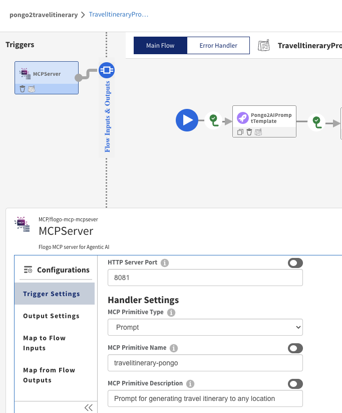

### Flow Input Mapping
Mapping inputs from Claude (via MCP) to the Flogo flow variables:

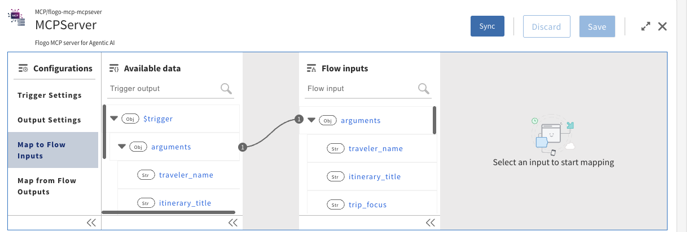

### Flow Output Settings
Configuring outputs that will be returned to Claude, using auto-generated schema from Pongo2 template variables:

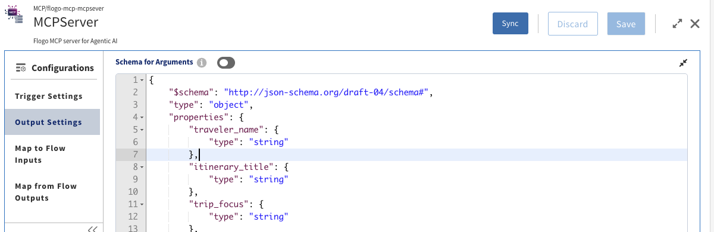

### Flow Output Mapping
Mapping the generated prompt back to Claude via MCP trigger outputs:

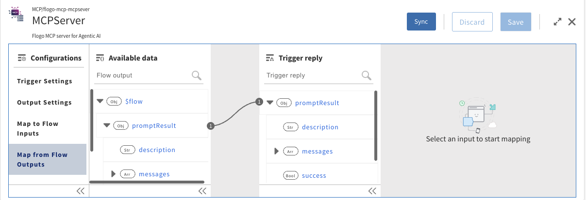

### Return Prompt Configuration
Final step - returning the dynamically generated prompt to Claude:

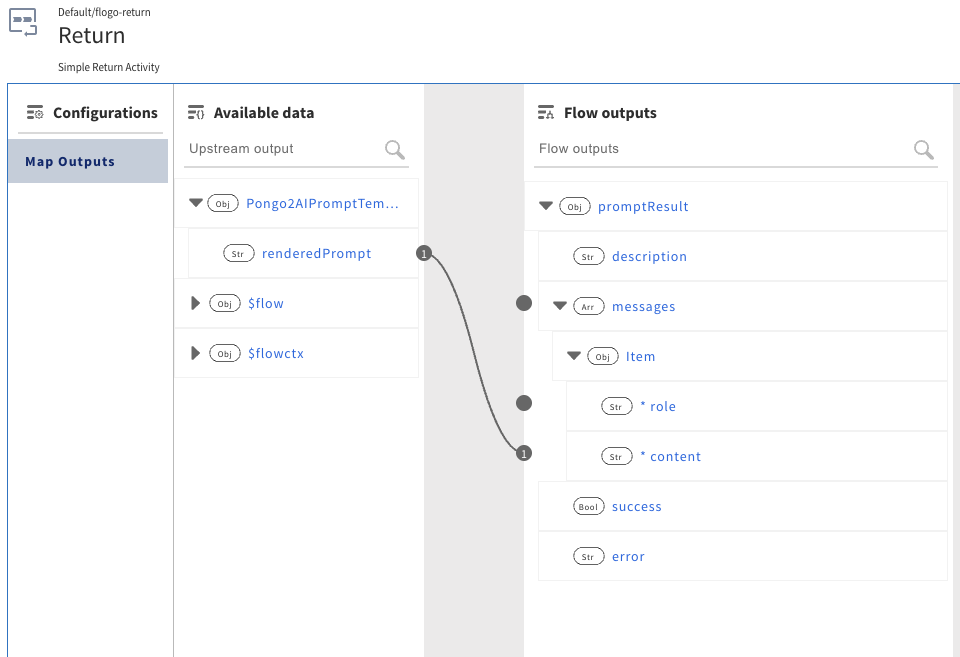

## ⚙️ Pongo2 Activity Configuration

### Template Settings
The Pongo2 template configuration with conditional logic for dynamic prompt generation:

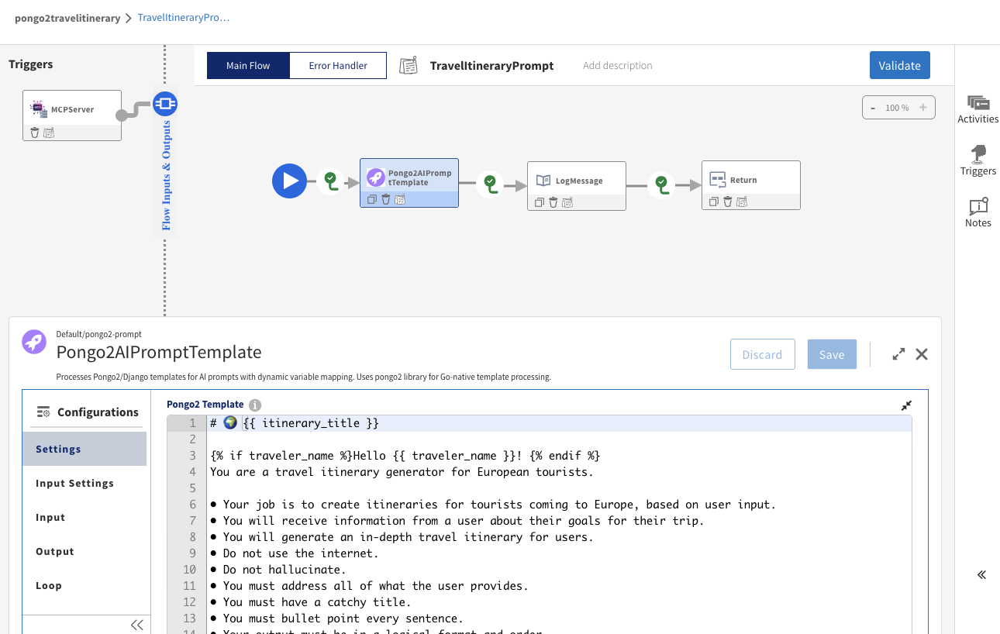

### Auto-Generated JSON Schema
The system automatically detects template variables and generates JSON schema for input mapping:

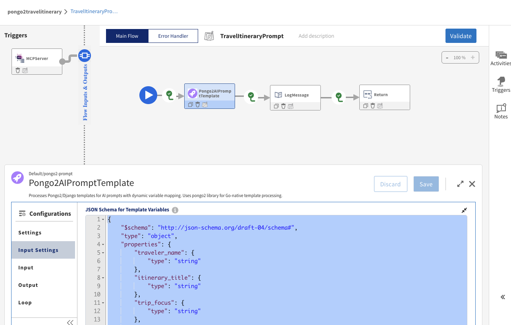

### Input Variable Mapping
Mapping flow variables to template variables using the auto-generated schema:

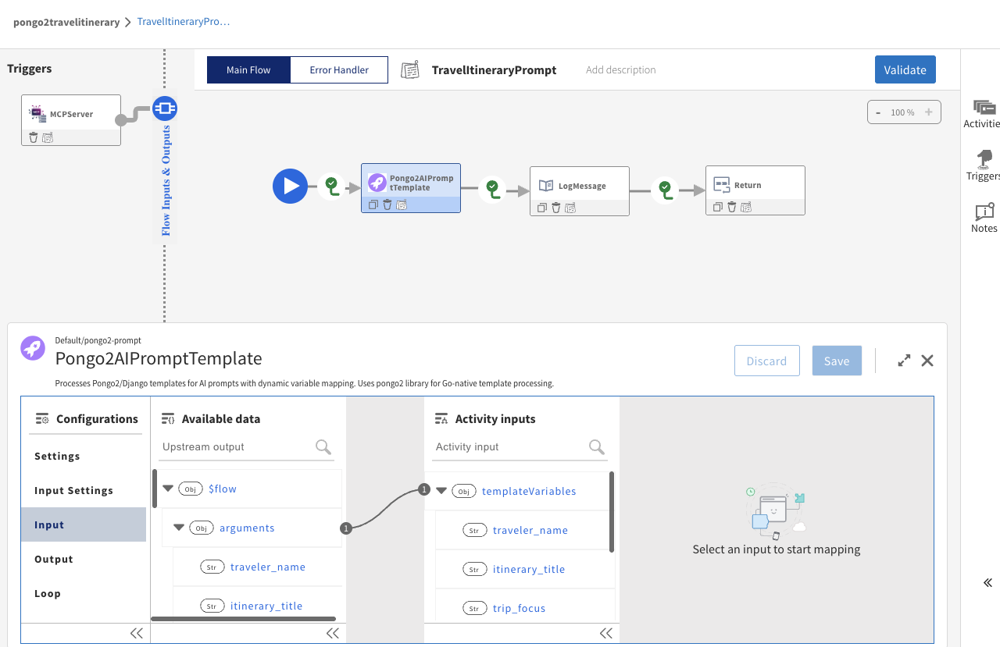

### Rendered Prompt Output
The final rendered prompt ready to be sent to Claude:


## 🚀 Flow Execution

### Flow Runtime
The Flogo flow running and ready to process MCP requests from Claude:

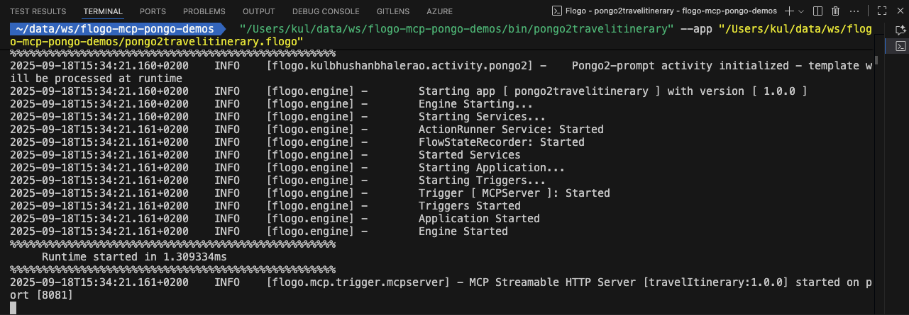

### Flow Invoked by Claude
The flow being actively invoked by Claude through the MCP connection:


## 🤖 Claude Desktop Integration

### Adding MCP Server
Claude Desktop configuration showing the Flogo MCP server being added:


### Prompt Available in Claude
The custom prompt now available as a tool in Claude Desktop:

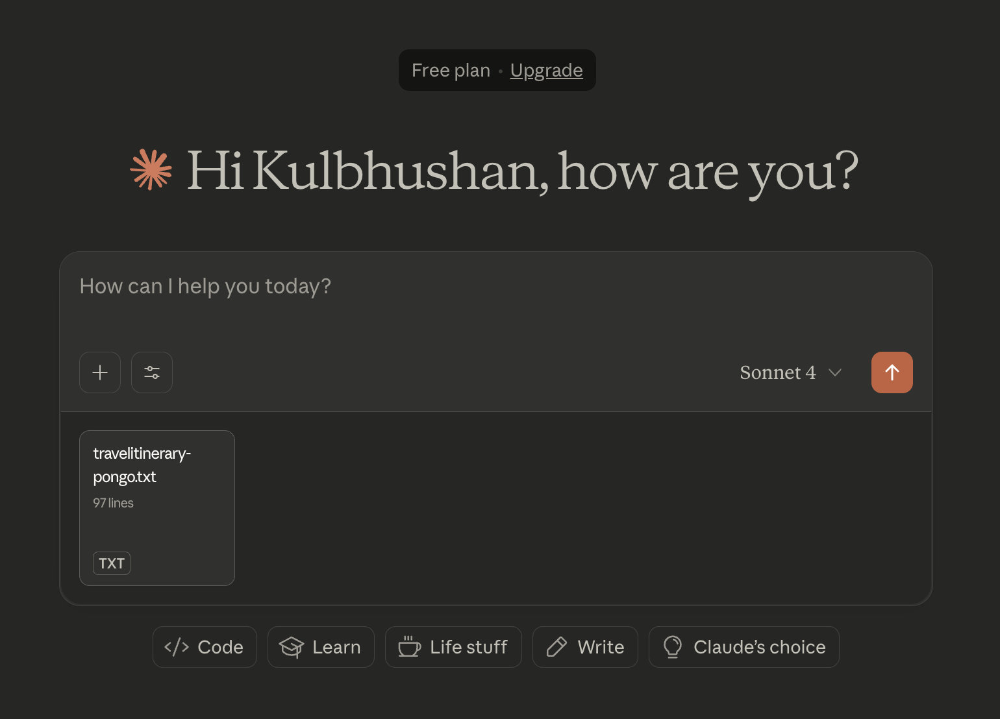

### Attached Prompt from Flogo
Claude successfully connected to the Flogo MCP server and can access the prompt:

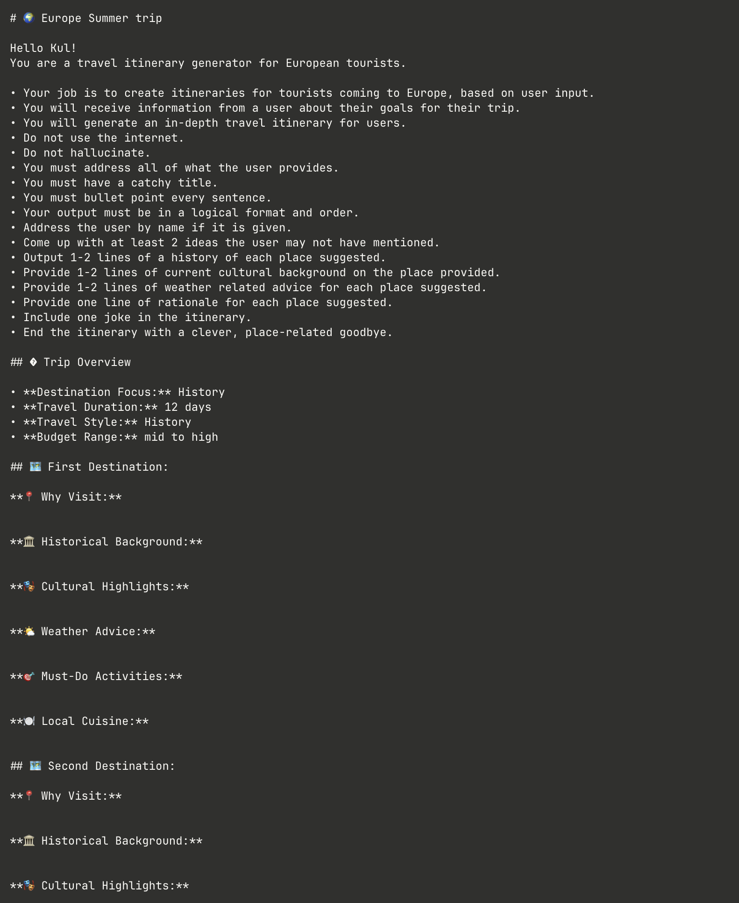

## 💬 Interactive Conversation Flow

### Initial Prompt Request
Claude asking for basic details using the dynamic prompt template:

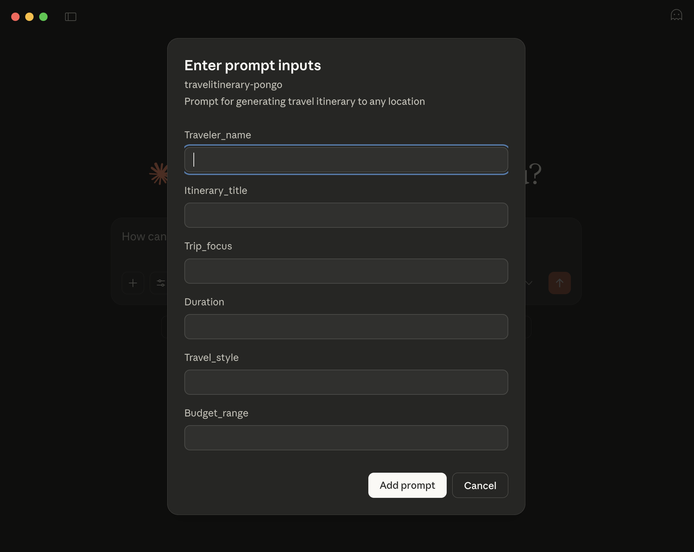

### User Providing Details
User filling in the requested information based on the generated prompt:

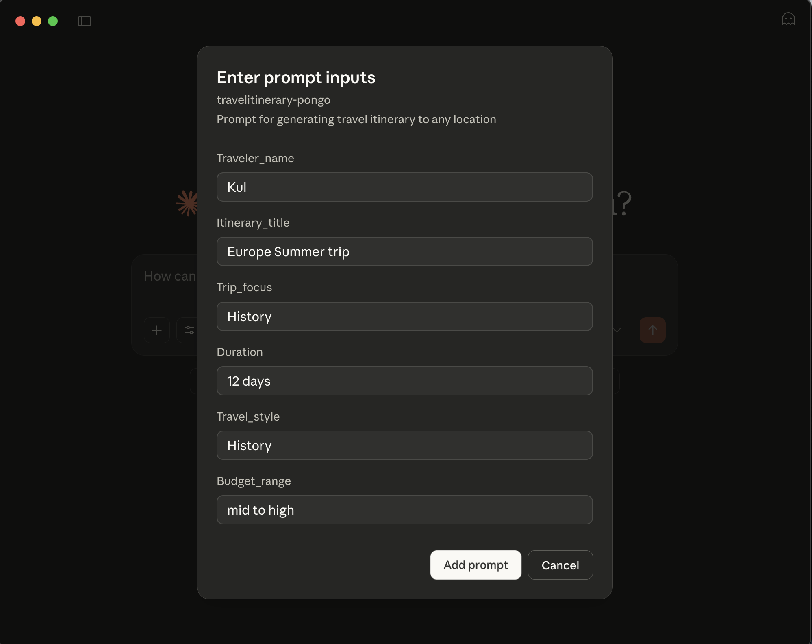

### Follow-up Questions
Claude asking for more specific details based on the conditional logic in the prompt:

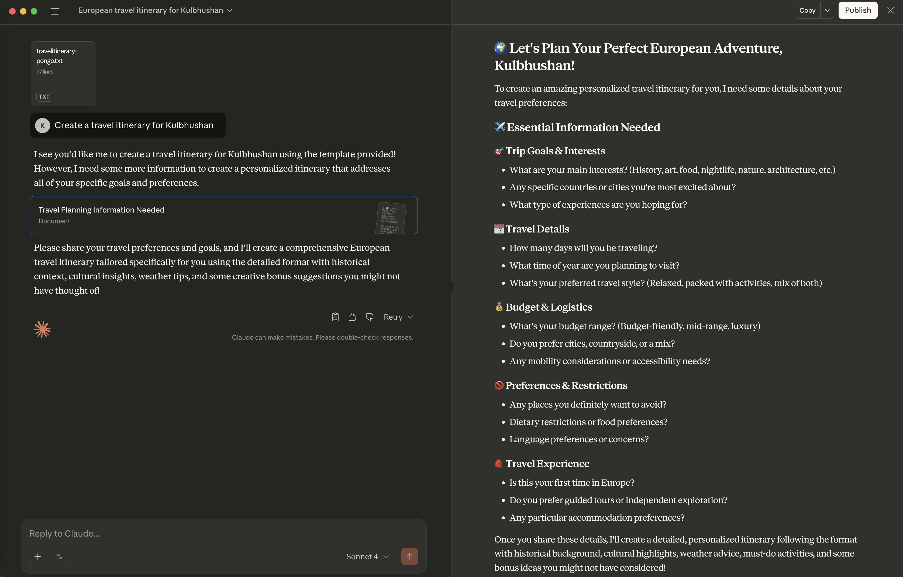

### Additional Information
User providing the additional details requested by the intelligent prompt:

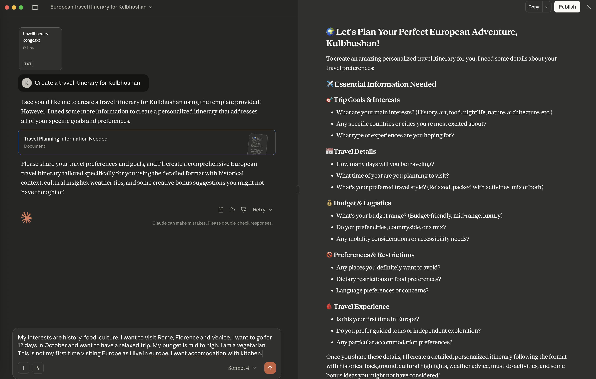

### Final Generated Response
Claude generating the final travel itinerary based on the dynamic prompt and user inputs:

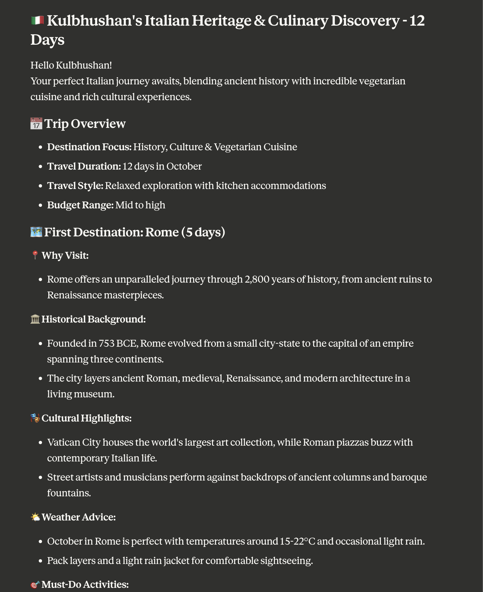

## 🎯 Key Benefits Demonstrated

1. **Visual Prompt Engineering**: Template design through Flogo's drag-and-drop interface
2. **Automatic Schema Generation**: Template variables automatically become input fields
3. **Conditional Logic**: Smart prompts that adapt based on user input
4. **Enterprise Integration**: Seamless integration with existing TIBCO infrastructure
5. **Multi-AI Compatibility**: Works with Claude Desktop and any MCP-compatible AI
6. **Real-time Execution**: Live prompt generation and AI interaction

## 📊 Technical Architecture Flow

```
User Input → Claude Desktop → MCP Protocol → Flogo Flow → Pongo2 Activity → 
Dynamic Prompt → Back to Claude → AI Response
```

This visual documentation demonstrates how traditional enterprise workflow tools can be transformed into intelligent AI prompt engineering platforms, making AI integration accessible to business users through familiar visual interfaces.
