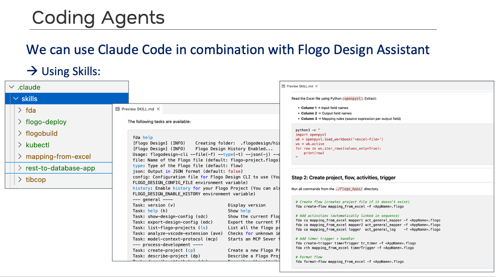
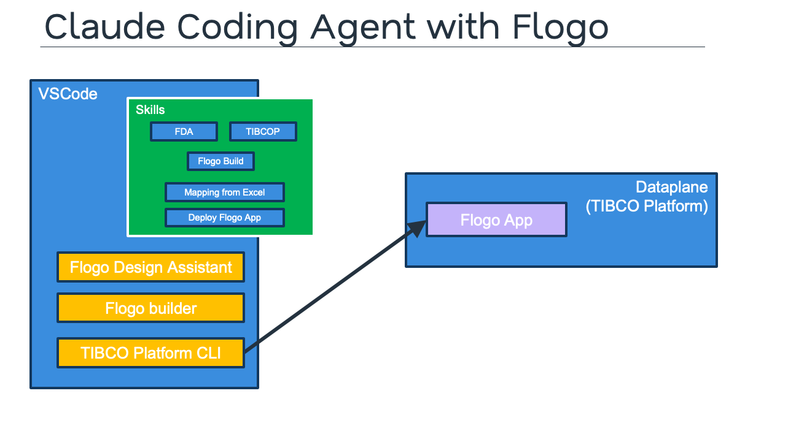
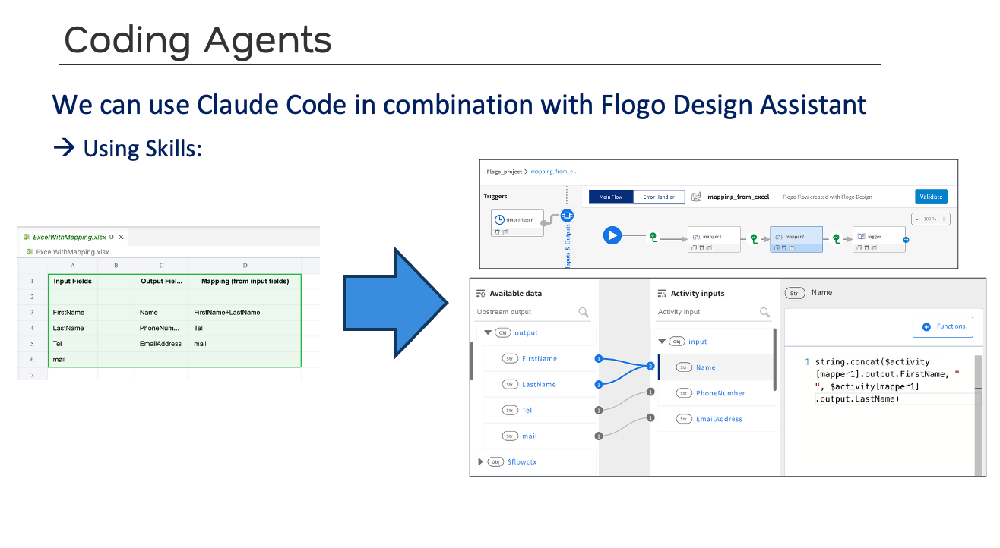
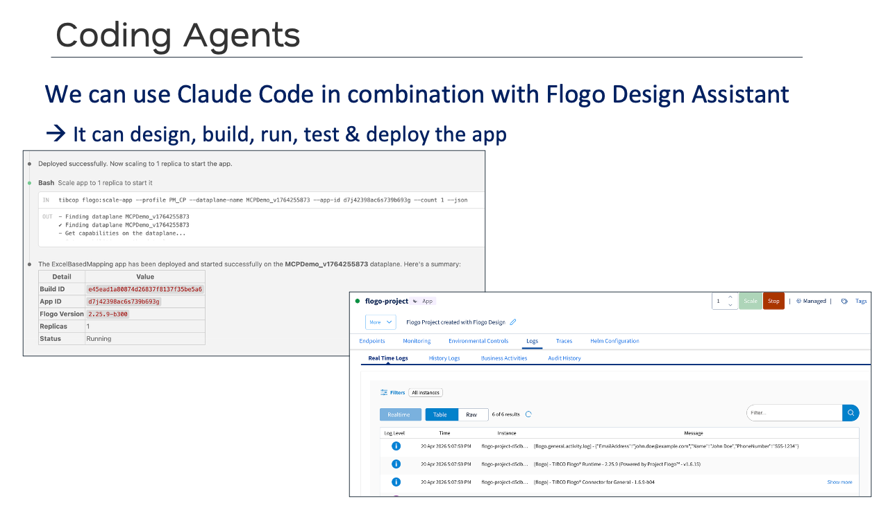
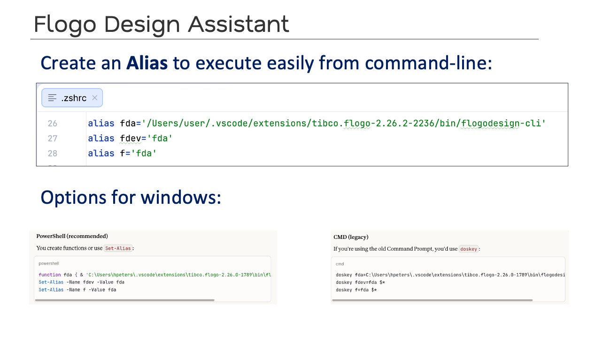

# Flogo Skill Library

A library of **skills for AI coding agents** (such as **Claude Code**) to design, build, test, and deploy TIBCO Flogo integration applications. Drop these skills into the `.claude/skills/` directory of any project and the agent will use them to drive the Flogo, build, and platform CLIs end-to-end.

## Run the Flogo Skill Library Template

[Open the Flogo Skill Library Template](/tibco/hub/create/templates/default/flogo-skill-library-template) to scaffold a new project pre-seeded with the skills, an `AGENT.md` for your coding agent, and the docs you're reading now.

---

## What's a Skill?

A **skill** is a Markdown file with frontmatter that documents a specific capability for an AI coding agent. The agent reads the skill on demand when the user's request matches its description. Skills make the agent reliable and repeatable on domain-specific tasks (like building a Flogo flow) — without you having to explain the same patterns over and over.

Each skill in this library lives in `.claude/skills/<skill-name>/SKILL.md` and follows this shape:

```markdown
---
name: <skill-name>
description: <when the agent should use this skill>
user-invocable: true
---

# Step-by-step instructions, command references, and recipes...
```



---

## What's in this Library

The library contains **6 skills** that cover the full Flogo development lifecycle — from designing a flow, to building an executable, to deploying it on the TIBCO Platform.

| Skill | Type | Purpose |
|---|---|---|
| **fda** | CLI reference | Full reference for the **Flogo Design Assistant** CLI — every task to create or modify a `.flogo` file (flows, activities, triggers, schemas, properties, tests). |
| **flogobuild** | CLI reference | Reference for **building executables** and TIBCO Platform deployment artifacts from `.flogo` files. |
| **tibcop** | CLI reference | Reference for the **TIBCO Platform CLI** — manage builds, deploy, scale, and inspect Flogo applications on a dataplane. |
| **flogo-deploy** | Recipe | End-to-end recipe to **deploy a `.flogo` app to a TIBCO Platform dataplane** (build → values → deploy → scale). |
| **mapping-from-excel** | Recipe | Recipe to **build a Flogo flow from an Excel mapping spec** — input fields, output fields, and per-field mapping rules. |
| **rest-to-database-app** | Recipe | Recipe to **scaffold a REST API Flogo app that queries a database** (REST trigger → log → DB query → reply). |

---

## Architecture: Coding Agent + Flogo

The skills work alongside the rest of the Flogo developer toolkit. The coding agent uses **VS Code with the Flogo Design Assistant** for design-time editing, **flogobuild** for local builds, and the **TIBCO Platform CLI (`tibcop`)** to deploy applications to a dataplane on the TIBCO Platform.



---

## Example: Excel-to-Flogo Mapping

Using the `mapping-from-excel` skill, the agent can read an Excel mapping spec — input fields in column A, output fields in column B, and a mapping expression in column C — and turn it into a fully wired Flogo flow with two mappers, a logger, and a timer trigger.



A typical prompt:

> *"Read `ExcelWithMapping.xlsx` and create a Flogo flow that performs the mapping defined in the spreadsheet. Then build it and run it locally for 5 seconds and show me the logs."*

---

## Example: Design, Build, Run, and Deploy

The `flogo-deploy` skill chains together the build (`flogobuild`), values generation, deployment (`tibcop flogo:deploy-app-release`), and scale-up (`tibcop flogo:scale-app`) steps. The agent can take an app from source to a running instance on the TIBCO Platform in a single conversation.



A typical prompt:

> *"Deploy the `Flogo_Apps/customer-api.flogo` app to dataplane `<DATAPLANE_NAME>` and start it."*

---

## Getting Started

### Option 1: Install via the Marketplace template

1. Open the **Flogo Skill Library** entry in the TIBCO Developer Hub Marketplace.
2. Click **Get** to install the documentation.
3. Open [the Flogo Skill Library Template](/tibco/hub/create/templates/default/flogo-skill-library-template) to generate a new project pre-seeded with the skills.
4. Open the generated GitHub repo in **VS Code with Claude Code** installed.
5. Edit `CLAUDE.md` and replace the placeholders (`<YOUR_FLOGO_CONTEXT>`, `<YOUR_PROFILE>`, `<DATAPLANE_NAME>`) with the values for your environment.
6. Start asking the agent to design, build, run, or deploy Flogo apps.

### Option 2: Add skills to an existing project

If you already have a project, copy the `.claude/skills/` folder from the seed repo into your project root, and add the conventions to your project's `CLAUDE.md`.

---

## Required Tools

The skills assume the following CLIs are installed and on your `PATH`:

| Tool | Purpose | Documentation |
|---|---|---|
| **fda** (Flogo Design Assistant) | Design-time edits to `.flogo` files | [Flogo](https://docs.tibco.com/products/tibco-flogo-enterprise) |
| **flogobuild** | Build executables and Platform deployment artifacts | [Flogo](https://docs.tibco.com/products/tibco-flogo-enterprise) |
| **tibcop** (TIBCO Platform CLI) | Deploy and manage applications on the TIBCO Platform | [TIBCO Platform](https://www.tibco.com/platform) |
| **VS Code + Flogo Extension** (optional) | Visual designer for `.flogo` files | [Flogo](https://docs.tibco.com/products/tibco-flogo-enterprise) |
| **Claude Code** (or another coding agent) | Reads and applies the skills | [Claude Code](https://www.anthropic.com/claude-code) |

---

## Setting up the `fda` alias

The Flogo Design Assistant CLI ships with the **TIBCO Flogo VS Code extension** at a long path like `<vscode-extensions-dir>/tibco.flogo-<version>/bin/flogodesign-cli`. Set up an `fda` alias so you (and the coding agent) can simply run `fda <task>` from any terminal.



### Find the path to `flogodesign-cli`

The exact path depends on your OS, your username, and the installed Flogo extension version:

| OS | Typical path |
|---|---|
| macOS / Linux | `/Users/<USERNAME>/.vscode/extensions/tibco.flogo-<VERSION>/bin/flogodesign-cli` |
| Windows | `C:\Users\<USERNAME>\.vscode\extensions\tibco.flogo-<VERSION>\bin\flogodesign-cli` |

> **Tip:** List installed extension versions with `ls ~/.vscode/extensions | grep tibco.flogo` (macOS/Linux) or `dir %USERPROFILE%\.vscode\extensions | findstr tibco.flogo` (Windows).

### macOS / Linux (zsh or bash)

Add the alias to your shell startup file — `~/.zshrc` for zsh (the macOS default) or `~/.bashrc` for bash:

```bash
# ~/.zshrc  or  ~/.bashrc
alias fda='/Users/<USERNAME>/.vscode/extensions/tibco.flogo-<VERSION>/bin/flogodesign-cli'

# Optional shorter aliases
alias fdev='fda'
alias f='fda'
```

Reload the shell so the alias takes effect:

```bash
source ~/.zshrc   # or: source ~/.bashrc
```

Verify:

```bash
fda version
```

### Windows — PowerShell (recommended)

PowerShell aliases cannot accept arguments, so define `fda` as a **function** and use `Set-Alias` for the shorter names. Add to your PowerShell profile (`$PROFILE`):

```powershell
function fda { & 'C:\Users\<USERNAME>\.vscode\extensions\tibco.flogo-<VERSION>\bin\flogodesign-cli' @args }
Set-Alias -Name fdev -Value fda
Set-Alias -Name f    -Value fda
```

Open or create your profile with:

```powershell
notepad $PROFILE
```

If `$PROFILE` doesn't exist yet, create it first:

```powershell
New-Item -Type File -Path $PROFILE -Force
```

Reload the profile:

```powershell
. $PROFILE
```

Verify:

```powershell
fda version
```

### Windows — Command Prompt (legacy)

If you're using the classic `cmd.exe`, use `doskey`. Note that `doskey` macros only live in the current session — to make them permanent, save the commands in a `.cmd` file and register it via `HKCU\Software\Microsoft\Command Processor\AutoRun`.

```cmd
doskey fda=C:\Users\<USERNAME>\.vscode\extensions\tibco.flogo-<VERSION>\bin\flogodesign-cli $*
doskey fdev=fda $*
doskey f=fda $*
```

The trailing `$*` forwards all arguments to the underlying command.

---

## Configurable Defaults

The skills reference a few placeholder values that you should set once in your project's `CLAUDE.md`:

| Placeholder | What to set it to | How to find the value |
|---|---|---|
| `<YOUR_FLOGO_CONTEXT>` | Build context name for `flogobuild` (e.g. `flogo-2.26.0-1789`) | `flogobuild list-context` |
| `<YOUR_PROFILE>` | TIBCO Platform CLI profile name | `tibcop list-profiles` |
| `<DATAPLANE_NAME>` | Default dataplane to deploy to | `tibcop tplatform:list-data-planes --profile <YOUR_PROFILE>` |

---

## Tips for Working with the Agent

- **Be explicit about file paths.** The agent works best when you tell it where to put the `.flogo` file (e.g. `Flogo_Apps/customer-api.flogo`).
- **Iterate in small steps.** Ask for a flow first, then add activities, then add the trigger, then build & test.
- **Always run a local test before deploying.** The `mapping-from-excel` and `rest-to-database-app` recipes both include a build + 5-second-run step.
- **Check the agent's commands.** The `fda` and `tibcop` commands are well-documented in the skills — if the agent does something unexpected, ask it to explain which skill it used and which command it ran.


[Open Template to Create a new Projec with Flogo Skills](/tibco/hub/create/templates/default/flogo-skill-library-template)
